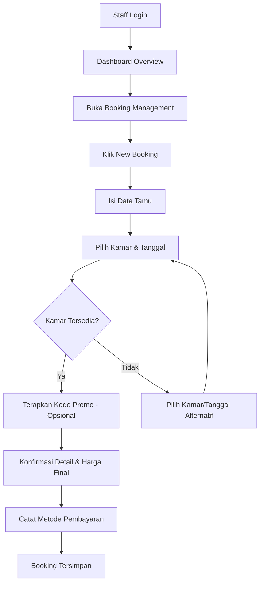
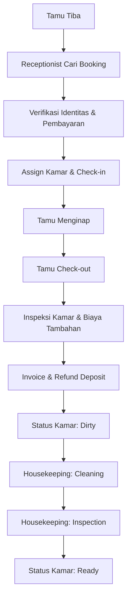
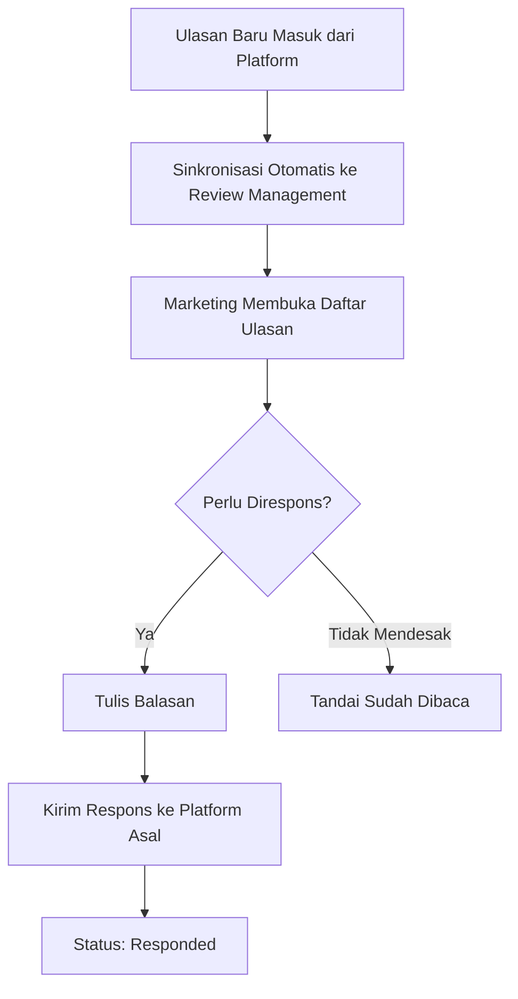
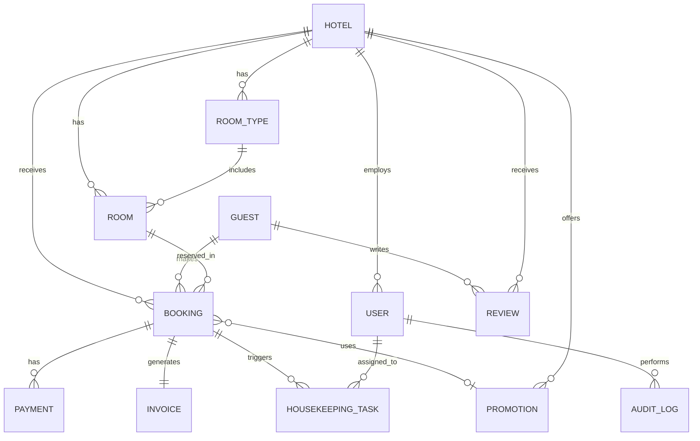

# PRD — Calam: Smart Hotel Booking & Operations Dashboard (Versi Lengkap)

> **Tagline:** *One Dashboard to Manage Every Stay.*

## 1. Metadata

| Field | Detail |
|---|---|
| Nama Produk | Calam |
| Tipe Dokumen | Product Requirements Document (PRD) — Versi Lengkap |
| Versi | 2.0 — mencakup seluruh modul dashboard sebagai MVP, lengkap dengan inventaris tombol per layar |
| Tanggal | 30 Juli 2026 |
| Status | Draft — Siap untuk Review Stakeholder |
| Pemilik Dokumen | *(diisi oleh Product Owner terkait)* |
| Disusun oleh | Tim Produk Lintas Fungsi (PM, Design, Engineering, QA) |
| Perubahan dari v1.0 | Review Management & Promotions dipindah dari Fase 2 menjadi MVP; setiap Screen Specification kini memuat field "Tombol & Aksi pada Layar"; ditambahkan tabel AI Feature Integration Points |

---

## 2. Executive Summary

Calam adalah dashboard operasional hotel berbasis web yang menyatukan seluruh proses harian sebuah hotel — reservasi, kamar, tamu, housekeeping, pembayaran, ulasan, promosi, staf, hingga laporan bisnis — dalam satu sistem terintegrasi. Ditujukan untuk enam peran internal (Owner, Manager, Receptionist, Housekeeping, Finance, Marketing), Calam mengganti kombinasi aplikasi terpisah dan proses manual yang selama ini menyebabkan double booking, status kamar yang tidak sinkron, dan laporan bisnis yang lambat dibuat. Versi PRD ini mencakup **seluruh 14 modul dashboard sebagai MVP** — setiap menu di sidebar memiliki halaman fungsional lengkap dengan aksi/tombol yang terdefinisi jelas, sehingga dokumen ini dapat langsung dijadikan acuan implementasi maupun desain wireframe tanpa modul yang "menggantung". Di luar itu, delapan kapabilitas AI dirancang sebagai lapisan tambahan yang menempel pada layar-layar yang sudah ada begitu data historis mencukupi.

---

## 3. Product Vision

Membangun platform manajemen hotel modern yang menyederhanakan seluruh operasional hotel dalam satu dashboard, dengan dukungan otomatisasi dan AI, untuk meningkatkan efisiensi staf, pendapatan hotel, dan kepuasan tamu.

---

## 4. Business Goals

| # | Tujuan Bisnis | Terhubung ke Metrik |
|---|---|---|
| BG-1 | Meningkatkan occupancy rate | Occupancy Rate |
| BG-2 | Mengurangi kesalahan reservasi (double booking, data tamu tersebar) | Booking Error Rate, Cancellation Rate |
| BG-3 | Mempercepat proses check-in dan check-out | Average Check-in/Check-out Time |
| BG-4 | Meningkatkan pendapatan hotel (termasuk lewat promosi terukur) | ADR, RevPAR, Monthly Revenue Growth |
| BG-5 | Menyediakan laporan bisnis secara real-time, tanpa proses manual | Waktu penyusunan laporan |
| BG-6 | Menyatukan seluruh proses lintas departemen dalam satu dashboard, tanpa modul yang tertinggal | Adoption rate staf lintas departemen |
| BG-7 | Menjaga reputasi online hotel lewat pemantauan & respons ulasan yang cepat | Average Guest Rating, Response Rate |

---

## 5. Personas

### Persona 1 — Primary: Ibu Wulan, Hotel Manager
| Field | Detail |
|---|---|
| Peran di sistem | Hotel Manager |
| Demografi | 36 tahun, mengelola operasional harian 1 hotel (80 kamar) dengan 25 staf lintas departemen |
| Tujuan | Memantau performa seluruh departemen dalam satu layar, menyelesaikan konflik reservasi cepat, memastikan target occupancy tercapai |
| Frustrasi | Harus membuka aplikasi berbeda untuk booking, housekeeping, dan laporan keuangan; sulit tahu masalah operasional sebelum jadi komplain tamu |
| Perilaku | Login sepanjang hari dari laptop, sesekali dari tablet saat berkeliling hotel |
| Tingkat melek teknologi | Menengah-tinggi |
| Kutipan | "Saya nggak mau tahu masalah dari komplain tamu di lobi — saya mau tahu dari dashboard, sebelum itu terjadi." |

### Persona 2 — Primary: Pak Rendra, Hotel Owner
| Field | Detail |
|---|---|
| Peran di sistem | Hotel Owner |
| Demografi | 45 tahun, memiliki hotel namun jarang berada di lokasi, mengecek performa dari jarak jauh |
| Tujuan | Memantau pendapatan dan KPI kunci tanpa harus di lokasi, mendapat insight untuk keputusan strategis (harga, promo, ekspansi) |
| Frustrasi | Laporan keuangan sering terlambat sampai ke tangannya; tidak tahu kondisi real-time saat travel |
| Perilaku | Membuka dashboard dari HP di sela kesibukan, butuh ringkasan cepat, bukan detail operasional |
| Tingkat melek teknologi | Menengah |
| Kutipan | "Saya nggak butuh semua detail — saya butuh tahu apakah bulan ini sehat atau tidak, dalam satu lihatan." |

### Persona 3 — Secondary: Dita, Receptionist
| Field | Detail |
|---|---|
| Peran di sistem | Receptionist |
| Demografi | 24 tahun, shift bergilir, menangani reservasi, check-in/out, dan pertanyaan tamu langsung |
| Tujuan | Menyelesaikan check-in dalam waktu singkat, membuat booking baru dengan cepat saat tamu walk-in atau telepon masuk |
| Frustrasi | Sistem lama lambat saat jam sibuk; sulit tahu kamar mana yang benar-benar siap dipakai |
| Perilaku | Menggunakan sistem sepanjang shift dari desktop di depan meja resepsionis |
| Tingkat melek teknologi | Menengah |
| Kutipan | "Kalau tamu sudah antre, saya butuh sistem yang secepat saya berpikir, bukan yang bikin saya menunggu loading." |

### Persona 4 — Secondary: Joko, Housekeeping Staff
| Field | Detail |
|---|---|
| Peran di sistem | Housekeeping |
| Demografi | 29 tahun, berkeliling fisik antar-lantai dan kamar sepanjang shift |
| Tujuan | Mengetahui kamar prioritas yang harus dibersihkan tanpa menunggu instruksi lisan dari supervisor |
| Frustrasi | Koordinasi manual via walkie-talkie/lisan sering menyebabkan kamar terlewat atau dikerjakan dua kali |
| Perilaku | Mengecek daftar tugas dari HP/tablet di sela membersihkan kamar |
| Tingkat melek teknologi | Menengah-rendah, butuh UI sangat sederhana |
| Kutipan | "Saya cuma perlu tahu: kamar mana dulu, dan tandai selesai — nggak perlu ribet." |

### Persona 5 — Tersier: Sinta, Finance Staff
| Field | Detail |
|---|---|
| Peran di sistem | Finance Staff |
| Demografi | 31 tahun, bertanggung jawab atas rekonsiliasi pembayaran dan laporan keuangan harian |
| Tujuan | Menutup laporan harian tanpa harus menghitung manual dari berbagai sumber pembayaran |
| Frustrasi | Data pembayaran tersebar antara catatan resepsionis dan bukti transfer manual |
| Perilaku | Login pagi dan sore untuk rekonsiliasi, sering ekspor data ke Excel |
| Tingkat melek teknologi | Menengah |
| Kutipan | "Kalau saya bisa percaya angkanya tanpa cross-check manual, saya hemat 2 jam sehari." |

### Persona 6 — Tersier: Amanda, Marketing Staff
| Field | Detail |
|---|---|
| Peran di sistem | Marketing Staff |
| Demografi | 27 tahun, mengelola promosi dan memantau ulasan tamu di berbagai platform |
| Tujuan | Mengukur efektivitas promo yang dijalankan, merespons ulasan tamu dengan cepat, mengelola voucher/loyalty program |
| Frustrasi | Ulasan tersebar di banyak platform (Google, OTA), sulit dipantau dalam satu tempat; sulit mengukur promo mana yang benar-benar mendatangkan booking |
| Perilaku | Login setiap hari kerja untuk memantau ulasan baru dan mengelola kampanye promo aktif |
| Tingkat melek teknologi | Tinggi |
| Kutipan | "Saya ingin tahu promo mana yang benar-benar mendatangkan booking, bukan cuma klik — dan saya ingin bisa membalas ulasan tanpa berpindah-pindah aplikasi." |

---

## 6. Jobs To Be Done (JTBD)

| Persona | JTBD |
|---|---|
| Hotel Manager | Ketika saya memulai shift pagi, saya ingin melihat ringkasan kondisi seluruh hotel, sehingga saya bisa memprioritaskan masalah sebelum jadi besar. |
| Hotel Manager | Ketika ada konflik jadwal kamar, saya ingin menyelesaikannya langsung dari kalender reservasi, sehingga tidak ada tamu yang dirugikan. |
| Hotel Owner | Ketika saya sedang bepergian, saya ingin membuka ringkasan performa hotel dari HP, sehingga saya tetap punya kendali tanpa harus di lokasi. |
| Hotel Owner | Ketika saya mengevaluasi bulan berjalan, saya ingin melihat tren pendapatan dan okupansi, sehingga saya bisa mengambil keputusan strategis tepat waktu. |
| Receptionist | Ketika tamu tiba untuk check-in, saya ingin memverifikasi booking dan pembayaran dalam satu layar, sehingga proses selesai dalam hitungan menit. |
| Receptionist | Ketika ada tamu walk-in, saya ingin membuat booking baru dan menerapkan kode promo bila ada, sehingga transaksi tercatat akurat sejak awal. |
| Housekeeping | Ketika shift saya dimulai, saya ingin melihat daftar kamar prioritas, sehingga saya tidak perlu menunggu instruksi manual. |
| Housekeeping | Ketika saya selesai membersihkan kamar, saya ingin menandai status langsung dari HP, sehingga resepsionis tahu kamar siap secara real-time. |
| Finance Staff | Ketika saya menutup laporan harian, saya ingin seluruh transaksi sudah terekonsiliasi otomatis, sehingga saya tidak perlu mencocokkan data manual. |
| Marketing Staff | Ketika ada ulasan baru masuk, saya ingin melihat dan membalasnya dari satu tempat, sehingga respons saya konsisten dan cepat di semua platform. |
| Marketing Staff | Ketika saya menjalankan kampanye promo, saya ingin membuat kode promo dan melihat berapa booking yang dihasilkan, sehingga saya tahu mana yang efektif dilanjutkan. |

---

## 7. Problem Statement

Banyak hotel masih menjalankan operasionalnya dengan beberapa aplikasi terpisah untuk reservasi, pembayaran, housekeeping, promosi, dan laporan bisnis. Akibatnya terjadi double booking, status kamar yang tidak diketahui secara real-time, proses check-in yang lambat, data tamu yang tersebar, ulasan pelanggan yang tercecer di banyak platform, promosi yang sulit diukur efektivitasnya, laporan pendapatan yang harus disusun manual, dan pemilik hotel yang kesulitan memonitor performa bisnis dari jarak jauh. Calam menyatukan seluruh proses tersebut — termasuk sisi customer-facing seperti ulasan dan promosi — dalam satu dashboard yang dapat diakses tiap departemen sesuai perannya.

### Competitive Benchmark

| Produk | Fokus Utama | Kekuatan | Kelemahan vs Calam |
|---|---|---|---|
| Cloudbeds | PMS + Channel Manager | Integrasi OTA luas | Modul review & promosi terpisah/add-on, tanpa AI insight bawaan |
| Mews | PMS modern, automation | UI modern, otomatisasi operasional | Harga tinggi, fokus pasar Eropa, kurang lokal untuk Asia Tenggara |
| Oracle OPERA Cloud | Enterprise PMS | Sangat matang untuk hotel besar | Kompleks, mahal, implementasi lama, overkill untuk hotel independen |
| RoomRaccoon | All-in-one PMS untuk hotel kecil-menengah | Mudah dipakai | Review & promotions module dasar, analitik & AI terbatas |
| Beds24 | PMS lokal populer di Asia Tenggara | Harga terjangkau | UI dasar, tanpa AI, tanpa modul review/promosi terintegrasi |
| **Calam** | Dashboard operasional hotel all-in-one — dari booking sampai review & promosi — dengan roadmap AI | Satu dashboard lintas departemen (front office-housekeeping-finance-marketing) tanpa modul terpisah, desain enterprise SaaS modern, AI-ready | — |

---

## 8. Success Metrics

**North Star Metric:** Occupancy Rate rata-rata hotel yang dikelola melalui Calam, dibanding baseline sebelum adopsi.

| Kategori | Metrik | Target Awal (6 bulan pasca-launch) |
|---|---|---|
| Bisnis | Occupancy Rate | +8% dibanding baseline |
| Bisnis | Average Daily Rate (ADR) | Tren positif konsisten, dipantau bulanan |
| Bisnis | Revenue per Available Room (RevPAR) | +10% |
| Bisnis | Monthly Revenue Growth | Tren positif konsisten 3 bulan berturut-turut |
| Operasional | Booking Conversion Rate | ≥ 90% booking pending menjadi confirmed |
| Operasional | Cancellation Rate | < 8% dari total booking |
| Operasional | Average Check-in Time | < 3 menit |
| Operasional | Average Check-out Time | < 3 menit |
| Operasional | Housekeeping Completion Rate (tepat waktu) | ≥ 95% |
| Kepuasan | Customer Satisfaction (CSAT) | ≥ 85% |
| Kepuasan | Average Guest Rating | ≥ 4.4 / 5 |
| Kepuasan | Repeat Guest Rate | ≥ 20% |
| Marketing | Review Response Rate | ≥ 90% dalam 48 jam |
| Marketing | Promo-Driven Booking Share | Terukur & dilaporkan tiap bulan |
| Teknis | Payment Success Rate | ≥ 98% |
| Teknis | Refund Processing Time | < 3 hari kerja |
| Adopsi | Staff Productivity (tugas selesai per shift) | Meningkat terukur dibanding baseline manual |

---

## 9. Assumptions

- **Skala:** Calam di-scope untuk **satu property/hotel independen per akun** (single-property) pada MVP. Dukungan multi-property/chain adalah perluasan arsitektur di fase berikutnya.
- **Sifat produk:** Calam adalah **dashboard operasional internal**, bukan situs booking publik untuk tamu. Reservasi dibuat/diinput oleh staf (walk-in, telepon, atau disalin dari OTA) melalui modul Booking Management.
- **Cakupan MVP diperluas penuh:** Berbeda dari draf sebelumnya, **seluruh 14 modul pada brief — termasuk Review Management dan Promotions — kini masuk MVP**, agar setiap menu di sidebar memiliki halaman fungsional sejak peluncuran pertama, bukan modul yang "menggantung" atau kosong.
- **AI Features bukan menu terpisah:** Kedelapan kapabilitas AI pada brief (Revenue Forecast, Dynamic Pricing, Booking Prediction, Cancellation Prediction, Smart Room Assignment, Review Analysis, Housekeeping Optimization, Executive Summary) **tidak membutuhkan halaman/menu sendiri** — brief aslinya juga menempatkan modul-modul inti (Section 6) terpisah dari AI Features (Section 7). AI dirancang sebagai lapisan yang menempel pada layar yang sudah ada (lihat Section 27 — AI Feature Integration Points), dan diaktifkan bertahap di Fase 2/3 setelah data historis operasional cukup untuk membuatnya akurat.
- **Platform:** Web dashboard, desktop-first untuk mayoritas modul. Modul **Housekeeping** dan **Check-in/Check-out** dibuat responsive untuk tablet.
- **Backend stack:** REST API Node.js (NestJS), PostgreSQL, Redis, hosting AWS ap-southeast-1 (Singapura).
- **Payment gateway:** Midtrans & Xendit untuk metode digital lokal (VA, QRIS, E-Wallet); pembayaran Cash/Debit/Kartu Kredit fisik dicatat manual oleh staf.
- **Integrasi Review Platform:** Sinkronisasi ulasan dari Google Business Profile dan platform OTA utama dilakukan via API resmi masing-masing platform (dikonfigurasi di Settings > API Integration); balasan otomatis dua-arah tunduk pada dukungan API tiap platform.
- **Role & permission:** 6 role — Owner, Manager, Receptionist, Housekeeping, Finance, Marketing — dengan matrix permission per modul (Section 22), kini mencakup penuh Review Management & Promotions.
- **Bahasa & mata uang:** Bahasa Indonesia (default) & Inggris; mata uang default IDR dengan opsi multi-currency.
- **Kepatuhan data:** Mengikuti UU PDP Indonesia; keamanan pembayaran mengikuti PCI-DSS via payment gateway.
- **Timeline MVP:** Dengan cakupan yang diperluas penuh (14 modul), estimasi MVP siap dalam 5-6 bulan dengan tim cross-functional kecil-menengah (1 PM, 2 designer, 6-7 engineer, 1-2 QA).
- **Desain visual:** Modern Enterprise SaaS — bersih, data-first, mendukung Light & Dark mode.

---

## 10. Feature List

| # | Fitur | Deskripsi Singkat | Modul Terkait | Prioritas | Fase |
|---|---|---|---|---|---|
| FT-01 | Autentikasi & Role-Based Access Control | Login staf, manajemen sesi, permission per role | Core | P0 | MVP |
| FT-02 | Dashboard Overview | KPI cards, analytics ringkas, recent activity, quick actions | Core | P0 | MVP |
| FT-03 | Booking Management | List, filter, detail, dan status reservasi | Front Office | P0 | MVP |
| FT-04 | Reservation Calendar | Kalender interaktif drag & drop dengan deteksi konflik | Front Office | P0 | MVP |
| FT-05 | Room Management | CRUD kamar, tipe kamar, dan status kamar | Front Office | P0 | MVP |
| FT-06 | Guest Management | Profil tamu, riwayat booking & pembayaran, notes | Front Office | P0 | MVP |
| FT-07 | Check-in & Check-out | Alur verifikasi, assign kamar, invoice, refund deposit | Front Office | P0 | MVP |
| FT-08 | Housekeeping | Room queue, cleaning status, task assignment | Housekeeping | P0 | MVP |
| FT-09 | Payment Center | Pencatatan & pengelolaan transaksi multi-metode | Finance | P0 | MVP |
| FT-10 | Revenue Analytics | Chart tren revenue, okupansi, ADR, RevPAR | Finance & Owner | P0 | MVP |
| FT-11 | Review Management | Agregasi ulasan tamu lintas platform + respons | Marketing | P0 | MVP |
| FT-12 | Staff Management | Profil staf, shift, attendance, task | HR/Operasional | P0 | MVP |
| FT-13 | Promotions | Promo code, voucher, flash sale, loyalty rewards | Marketing | P0 | MVP |
| FT-14 | Reports | Laporan otomatis + ekspor PDF/Excel/CSV | Core | P0 | MVP |
| FT-15 | Settings | Profil hotel, tipe kamar, pajak, payment gateway, roles, notifikasi, API integration, bahasa & mata uang | Core | P0 | MVP |
| FT-16 | AI Executive Summary | Ringkasan performa otomatis di Dashboard Overview | AI Layer | P1 | Fase 2 |
| FT-17 | AI Smart Room Assignment | Rekomendasi kamar otomatis di New Booking | AI Layer | P1 | Fase 2 |
| FT-18 | AI Housekeeping Optimization | Urutan prioritas otomatis di Room Queue | AI Layer | P1 | Fase 2 |
| FT-19 | AI Review Analysis | Sentiment tagging otomatis di Review Management | AI Layer | P1 | Fase 2 |
| FT-20 | AI Cancellation Prediction | Indikator risiko batal di Booking List/Detail | AI Layer | P2 | Fase 3 |
| FT-21 | AI Booking Prediction | Prediksi lonjakan reservasi di Dashboard/Analytics | AI Layer | P2 | Fase 3 |
| FT-22 | AI Revenue Forecast | Proyeksi pendapatan di Revenue Analytics | AI Layer | P2 | Fase 3 |
| FT-23 | AI Dynamic Pricing | Rekomendasi harga di Room Management | AI Layer | P2 | Fase 3 |

---

## 11. Feature Specifications

> Spesifikasi lengkap untuk seluruh **15 fitur P0 (MVP)** — FT-01 s.d. FT-15 — mencakup setiap menu di sidebar tanpa terkecuali. Lapisan AI (FT-16 s.d. FT-23) dijabarkan sebagai integration points di Section 27, karena sifatnya menempel pada layar existing, bukan halaman baru.

### FT-01 — Autentikasi & Role-Based Access Control

| Field | Detail |
|---|---|
| Objective | Memastikan setiap staf hanya bisa mengakses modul dan data sesuai role-nya |
| Business Value | Fondasi keamanan seluruh sistem |
| User Story | Sebagai staf hotel, saya ingin login dengan aman dan hanya melihat modul sesuai role saya |
| Acceptance Criteria | **Given** staf memasukkan email & password valid, **When** login berhasil, **Then** sistem mengarahkan ke Dashboard dengan sidebar sesuai role. <br>**Given** percobaan login gagal 5 kali, **When** percobaan ke-6, **Then** akun terkunci 15 menit + email notifikasi |
| Functional Requirements | Login email/password; reset password; logout semua device; session timeout otomatis |
| Non-functional Requirements | Response login < 1 detik (P95); token JWT 15 menit (access), 7 hari (refresh) |
| Business Rules | Hanya Owner & Manager (dengan izin) yang bisa membuat/menonaktifkan akun staf |
| Validation | Email format valid; password minimal 8 karakter kombinasi huruf & angka |
| Error States | Kredensial salah → pesan generik; akun terkunci → pesan + estimasi waktu unlock |
| Loading States | Spinner pada tombol login |
| Empty States | N/A |
| Success States | Toast "Login berhasil" + redirect |
| Permissions | Semua role dapat login |
| Dependencies | FT-12 (sumber data role & akun) |
| Edge Cases | Staf nonaktif dengan sesi aktif → auto-logout paksa |
| Risks | Brute force attack |
| Security Considerations | Rate limiting per IP, hash bcrypt/argon2, HTTPS wajib, audit log |
| Accessibility Notes | Form keyboard-navigable, label ARIA |
| Analytics Events | `login_success`, `login_failed`, `logout`, `password_reset_requested` |
| Priority | P0 |
| Estimated Complexity | M |

### FT-02 — Dashboard Overview

| Field | Detail |
|---|---|
| Objective | Memberikan ringkasan performa hotel real-time sebagai halaman utama |
| Business Value | Titik masuk pengambilan keputusan cepat, mengurangi cek manual ke tiap modul |
| User Story | Sebagai Hotel Manager, saya ingin melihat KPI dan aktivitas terkini dalam satu layar saat login |
| Acceptance Criteria | **Given** staf login, **When** dashboard dimuat, **Then** seluruh KPI menampilkan data hari berjalan sesuai role. <br>**Given** ada aktivitas baru, **When** terjadi, **Then** muncul di Recent Activity real-time |
| Functional Requirements | KPI cards (10 metrik — lihat Section 6 brief); chart (Revenue Trend, Booking Trend, Occupancy Heatmap, Top Booking Sources, Most Popular Room Type); Recent Activity feed; Quick Actions |
| Non-functional Requirements | KPI dimuat < 2 detik; update Recent Activity < 5 detik |
| Business Rules | Widget yang tampil disesuaikan permission role |
| Validation | N/A |
| Error States | Satu widget gagal load tidak menggagalkan seluruh dashboard |
| Loading States | Skeleton independen per widget |
| Empty States | Hotel baru → pesan "Data akan muncul setelah aktivitas tercatat" |
| Success States | N/A |
| Permissions | Semua role, konten adaptif (lihat Permission Matrix Section 22) |
| Dependencies | FT-03, FT-08, FT-09, FT-10 (sumber data widget) |
| Edge Cases | Data historis sangat sedikit (baru onboarding) |
| Risks | Query agregasi berat tanpa cache |
| Security Considerations | Double-check permission di level API, bukan hanya UI |
| Accessibility Notes | Chart dengan data table alternatif |
| Analytics Events | `dashboard_viewed`, `quick_action_used`, `widget_error_occurred` |
| Priority | P0 |
| Estimated Complexity | L |

### FT-03 — Booking Management

| Field | Detail |
|---|---|
| Objective | Mengelola seluruh siklus hidup reservasi |
| Business Value | Inti operasional front office |
| User Story | Sebagai Receptionist, saya ingin melihat, memfilter, dan mengelola seluruh booking dalam satu daftar |
| Acceptance Criteria | **Given** staf membuat booking baru, **When** disimpan, **Then** muncul di list dengan status sesuai. <br>**Given** staf memfilter booking, **When** filter diterapkan, **Then** list diperbarui tanpa reload penuh |
| Functional Requirements | List (Booking ID, Guest, Room, Check-in/out, Total, Payment Status, Booking Status, Source); filter (tanggal, tipe kamar, status, tamu, sumber); detail (Guest Info, Room Detail, Payment History, Invoice, Timeline, Notes, Special Request, Dokumen) |
| Non-functional Requirements | List >10.000 booking tetap responsif via pagination server-side |
| Business Rules | Status: Pending → Confirmed → Checked In → Checked Out, cabang Cancelled/No Show/Refunded |
| Validation | Check-out setelah check-in; kamar tidak boleh bentrok |
| Error States | Konflik ketersediaan → pesan + saran alternatif |
| Loading States | Skeleton list & detail |
| Empty States | CTA "Buat Booking Pertama" |
| Success States | Toast konfirmasi |
| Permissions | Full: Owner, Manager, Receptionist. View: Finance. None: Housekeeping, Marketing |
| Dependencies | FT-05, FT-06, FT-09, FT-13 (penerapan kode promo) |
| Edge Cases | Booking OTA manual berpotensi duplikat; pembatalan sebagian (partial refund) |
| Risks | Kesalahan input manual dari sumber eksternal |
| Security Considerations | Setiap perubahan status dicatat audit log |
| Accessibility Notes | Tabel keyboard-navigable, status teks+ikon |
| Analytics Events | `booking_created`, `booking_updated`, `booking_status_changed`, `booking_filtered` |
| Priority | P0 |
| Estimated Complexity | L |

### FT-04 — Reservation Calendar

| Field | Detail |
|---|---|
| Objective | Visualisasi kalender interaktif seluruh reservasi |
| Business Value | Mengurangi double booking secara visual |
| User Story | Sebagai Receptionist, saya ingin melihat reservasi dalam kalender dan memindahkannya lewat drag & drop |
| Acceptance Criteria | **Given** staf membuka kalender, **When** memilih tampilan, **Then** reservasi tampil sebagai blok berwarna sesuai status. <br>**Given** staf men-drag ke slot bentrok, **When** dilepas, **Then** sistem menampilkan peringatan konflik |
| Functional Requirements | View harian/mingguan/bulanan; drag & drop; resize durasi; assignment kamar; deteksi konflik otomatis |
| Non-functional Requirements | Render >100 kamar & 1 bulan data tetap smooth |
| Business Rules | Perubahan via drag & drop tunduk aturan sama dengan edit manual |
| Validation | Tidak bisa drop ke slot terisi |
| Error States | Modal error konflik dengan detail |
| Loading States | Skeleton grid |
| Empty States | CTA ke FT-05 (Room Management) jika belum ada kamar |
| Success States | Toast + highlight blok berhasil dipindah |
| Permissions | Full: Owner, Manager, Receptionist. View: Housekeeping, Finance |
| Dependencies | FT-03, FT-05 |
| Edge Cases | Dua staf memindahkan booking sama bersamaan → optimistic locking |
| Risks | Performa menurun tanpa virtualisasi grid |
| Security Considerations | Perubahan drag & drop dicatat di audit log |
| Accessibility Notes | Alternatif list-view non-drag |
| Analytics Events | `calendar_viewed`, `booking_dragged`, `calendar_conflict_detected` |
| Priority | P0 |
| Estimated Complexity | L |

### FT-05 — Room Management

| Field | Detail |
|---|---|
| Objective | Mengelola data kamar fisik, tipe kamar, dan status kamar real-time |
| Business Value | Dasar akurasi ketersediaan |
| User Story | Sebagai Manager, saya ingin mengatur tipe dan status kamar agar ketersediaan selalu akurat |
| Acceptance Criteria | **Given** Manager membuat tipe kamar, **When** disimpan, **Then** tersedia untuk dipilih saat booking. <br>**Given** status diubah "Maintenance", **When** disimpan, **Then** kamar tidak muncul sebagai pilihan booking baru |
| Functional Requirements | CRUD tipe kamar (nama, kapasitas, harga, view, bed type, amenities, foto); CRUD kamar fisik (nomor, lantai); update status (Available/Reserved/Occupied/Cleaning/Maintenance/Out of Service) |
| Non-functional Requirements | Perubahan status ter-reflect ke modul lain < 3 detik |
| Business Rules | Kamar Maintenance/Out of Service tidak bisa dipilih booking baru |
| Validation | Nomor kamar unik; harga positif |
| Error States | Nomor kamar duplikat → error inline |
| Loading States | Skeleton tabel & grid |
| Empty States | CTA "Tambah Kamar Pertama" |
| Success States | Toast konfirmasi |
| Permissions | Full: Owner, Manager. View: Receptionist, Housekeeping (status saja) |
| Dependencies | FT-03, FT-04, FT-08, FT-23 (AI dynamic pricing di fase depan) |
| Edge Cases | Ubah tipe kamar dengan booking mendatang → peringatan dampak |
| Risks | Kesalahan update status massal |
| Security Considerations | Housekeeping hanya bisa ubah field status |
| Accessibility Notes | Status disertai ikon & teks |
| Analytics Events | `room_created`, `room_status_changed`, `room_type_updated` |
| Priority | P0 |
| Estimated Complexity | M |

### FT-06 — Guest Management

| Field | Detail |
|---|---|
| Objective | Menyimpan dan mengelola database tamu beserta riwayat |
| Business Value | Data tamu sebagai aset jangka panjang |
| User Story | Sebagai Receptionist, saya ingin melihat riwayat dan catatan khusus tamu untuk layanan personal |
| Acceptance Criteria | **Given** tamu pernah menginap, **When** dicari, **Then** riwayat lengkap ditampilkan. <br>**Given** staf menambah note, **When** disimpan, **Then** muncul setiap profil dibuka staf lain |
| Functional Requirements | Profil (nama, telepon, email, kewarganegaraan, paspor/ID, loyalty level, total stay, total spending); riwayat booking & pembayaran; guest notes |
| Non-functional Requirements | Pencarian < 1 detik untuk 100rb tamu |
| Business Rules | Notes bersifat internal, tidak terlihat tamu |
| Validation | Format email & telepon divalidasi |
| Error States | Duplikat terdeteksi → saran merge |
| Loading States | Skeleton profil |
| Empty States | "Belum ada riwayat menginap" |
| Success States | Toast konfirmasi |
| Permissions | Full: Owner, Manager, Receptionist. View: Finance, Marketing |
| Dependencies | FT-03, FT-09 |
| Edge Cases | Nama sama, orang berbeda; booking atas nama orang lain |
| Risks | Data pribadi tersebar tanpa kontrol akses |
| Security Considerations | Dokumen identitas dienkripsi at-rest |
| Accessibility Notes | Heading terstruktur untuk screen reader |
| Analytics Events | `guest_profile_viewed`, `guest_profile_updated`, `guest_note_added` |
| Priority | P0 |
| Estimated Complexity | M |

### FT-07 — Check-in & Check-out

| Field | Detail |
|---|---|
| Objective | Mempercepat dan mengakuratkan proses kedatangan/kepulangan tamu |
| Business Value | Titik kritis pengalaman tamu & efisiensi staf |
| User Story | Sebagai Receptionist, saya ingin memverifikasi booking-identitas-pembayaran dalam satu alur |
| Acceptance Criteria | **Given** tamu tiba, **When** verifikasi selesai, **Then** assign kamar & key card dalam satu alur. <br>**Given** check-out, **When** inspeksi & biaya dikonfirmasi, **Then** invoice final otomatis terkirim |
| Functional Requirements | **Check-in:** verifikasi booking/identitas, upload paspor, verifikasi pembayaran, assign kamar, tanda tangan digital, key card. **Check-out:** inspeksi kamar, biaya tambahan, refund deposit, invoice, struk |
| Non-functional Requirements | End-to-end < 3 menit |
| Business Rules | Check-in hanya pada/setelah tanggal check-in; outstanding balance ditandai jelas |
| Validation | Reservasi harus "Confirmed" |
| Error States | Reservasi tidak ditemukan → saran booking walk-in |
| Loading States | Spinner tiap langkah |
| Empty States | N/A |
| Success States | Konfirmasi visual besar |
| Permissions | Full: Owner, Manager, Receptionist |
| Dependencies | FT-03, FT-06, FT-09, FT-05 |
| Edge Cases | Early check-in kamar belum siap; upload dokumen gagal |
| Risks | Antrean panjang saat peak time |
| Security Considerations | Dokumen identitas terenkripsi |
| Accessibility Notes | Tombol besar untuk tablet |
| Analytics Events | `checkin_started`, `checkin_completed`, `checkout_completed`, `additional_charge_added` |
| Priority | P0 |
| Estimated Complexity | M |

### FT-08 — Housekeeping

| Field | Detail |
|---|---|
| Objective | Mengoordinasikan tugas pembersihan kamar sistematis |
| Business Value | Mempercepat kesiapan kamar, mengurangi miskomunikasi antar-shift |
| User Story | Sebagai Housekeeping, saya ingin melihat daftar kamar prioritas dan menandainya selesai |
| Acceptance Criteria | **Given** kamar "Checked Out", **When** proses selesai, **Then** masuk Room Queue status "Dirty". <br>**Given** pembersihan selesai jadi "Ready", **When** diubah, **Then** langsung tersedia untuk booking baru |
| Functional Requirements | Room Queue terprioritas; Cleaning Status (Dirty/Cleaning/Inspection/Ready); Task Assignment oleh supervisor |
| Non-functional Requirements | Update status ter-reflect < 3 detik |
| Business Rules | Status "Inspection" perlu konfirmasi supervisor sebelum "Ready" |
| Validation | Perubahan status berurutan, tidak melompat |
| Error States | Gagal update (offline) → antrean retry otomatis |
| Loading States | Skeleton Room Queue |
| Empty States | "Semua kamar sudah siap" |
| Success States | Toast/haptic ringan |
| Permissions | Full: Owner, Manager, Housekeeping. View: Receptionist |
| Dependencies | FT-05, FT-07, FT-12, FT-18 (AI optimization fase depan) |
| Edge Cases | Kamar perlu maintenance saat inspeksi → eskalasi ke FT-05 |
| Risks | Sinyal lemah di lapangan |
| Security Considerations | Housekeeping hanya bisa ubah field status |
| Accessibility Notes | Target sentuh besar, kontras tinggi |
| Analytics Events | `room_queue_viewed`, `cleaning_status_changed`, `task_assigned` |
| Priority | P0 |
| Estimated Complexity | M |

### FT-09 — Payment Center

| Field | Detail |
|---|---|
| Objective | Mencatat dan mengelola seluruh transaksi pembayaran |
| Business Value | Akurasi pembayaran langsung berdampak arus kas |
| User Story | Sebagai Finance Staff, saya ingin melihat seluruh transaksi dengan status jelas untuk rekonsiliasi cepat |
| Acceptance Criteria | **Given** tamu membayar digital, **When** callback diterima, **Then** status "Paid" otomatis. <br>**Given** refund disetujui, **When** diproses, **Then** status "Refunded" tercatat di laporan |
| Functional Requirements | Pencatatan multi-metode (Cash/Debit/Credit Card/Bank Transfer/VA/QRIS/E-Wallet); status (Paid/Pending/Failed/Refunded); generate invoice; refund parsial/penuh |
| Non-functional Requirements | Callback digital < 5 detik; idempotent terhadap webhook duplikat |
| Business Rules | Tunai/kartu fisik dicatat manual dengan bukti |
| Validation | Jumlah dicatat harus sesuai tagihan sebelum "Paid" |
| Error States | Gagal/timeout → status "Pending" + retry |
| Loading States | Spinner menunggu gateway |
| Empty States | Pesan kosong sederhana |
| Success States | Toast + status ter-update |
| Permissions | Full: Owner, Finance. Create/View: Manager, Receptionist |
| Dependencies | FT-03, FT-12, FT-13 (redeem promo) |
| Edge Cases | Pembayaran ganda; pembayaran diterima setelah booking dibatalkan |
| Risks | Kegagalan integrasi gateway saat traffic tinggi |
| Security Considerations | Tidak menyimpan data kartu mentah, webhook signature verification |
| Accessibility Notes | Status teks + ikon |
| Analytics Events | `payment_recorded`, `payment_success`, `payment_failed`, `refund_processed` |
| Priority | P0 |
| Estimated Complexity | L |

### FT-10 — Revenue Analytics

| Field | Detail |
|---|---|
| Objective | Menyajikan analisis performa bisnis berbasis data transaksi & okupansi |
| Business Value | Dasar keputusan strategis Owner & Manager |
| User Story | Sebagai Owner, saya ingin melihat tren pendapatan & okupansi untuk evaluasi kesehatan bisnis cepat |
| Acceptance Criteria | **Given** Owner memilih rentang tanggal, **When** dimuat, **Then** grafik & KPI tampil untuk periode tersebut. <br>**Given** revenue turun signifikan, **When** dashboard dimuat, **Then** disorot visual |
| Functional Requirements | Chart (Revenue Trend, Occupancy Trend, Booking Source, Revenue by Room Type, Cancellation Rate, Customer Growth); KPI (ADR, RevPAR, Occupancy, Average Stay, Customer Retention) |
| Non-functional Requirements | Query 1 tahun data < 3 detik (pre-agregasi harian) |
| Business Rules | Data historis diagregasi batch harian, hari berjalan real-time |
| Validation | Rentang tanggal maksimal 2 tahun |
| Error States | Widget gagal load → placeholder retry per widget |
| Loading States | Skeleton independen per chart |
| Empty States | "Data akan tersedia setelah beberapa minggu operasional" |
| Success States | N/A |
| Permissions | Full: Owner, Manager, Finance. View terbatas: Marketing |
| Dependencies | FT-03, FT-09, FT-13 (data promo untuk Booking Source) |
| Edge Cases | Hotel musiman dengan data fluktuatif |
| Risks | Query berat berdampak performa OLTP |
| Security Considerations | Role lain tidak boleh akses via manipulasi endpoint |
| Accessibility Notes | Chart dengan tabel data alternatif |
| Analytics Events | `analytics_viewed`, `analytics_filtered`, `analytics_exported` |
| Priority | P0 |
| Estimated Complexity | L |

### FT-11 — Review Management

| Field | Detail |
|---|---|
| Objective | Mengagregasi ulasan tamu dari berbagai platform dalam satu tempat untuk dipantau dan direspons |
| Business Value | Menjaga reputasi online dan rating hotel lewat respons cepat |
| User Story | Sebagai Marketing Staff, saya ingin melihat seluruh ulasan lintas platform dan meresponsnya dari satu tempat |
| Acceptance Criteria | **Given** ulasan baru masuk dari platform terhubung, **When** disinkronkan, **Then** muncul dengan rating, komentar, platform. <br>**Given** staf merespons ulasan, **When** disimpan, **Then** status berubah "Responded" |
| Functional Requirements | List ulasan dengan filter (platform, rating, sentiment, response status); detail ulasan; form respons; sentiment tag (manual di MVP, otomatis via FT-19) |
| Non-functional Requirements | Sinkronisasi terjadwal tiap beberapa jam via job scheduler |
| Business Rules | Ulasan yang sudah direspons tidak bisa direspons ulang (mengikuti kebijakan API platform) |
| Validation | Teks respons tidak boleh kosong |
| Error States | Gagal sinkron (API down) → status "Sync Failed" + timestamp terakhir berhasil |
| Loading States | Skeleton list ulasan |
| Empty States | Belum ada ulasan tersinkron → CTA "Hubungkan Platform Review" (ke Settings) |
| Success States | Toast saat respons berhasil dikirim |
| Permissions | Full: Owner, Marketing. View: Manager. None: Receptionist, Housekeeping, Finance |
| Dependencies | FT-15 (API Integration), FT-06 (linking ke profil tamu bila cocok) |
| Edge Cases | Ulasan anonim tanpa profil tamu cocok; ulasan berbahasa asing |
| Risks | Ketergantungan pada API pihak ketiga yang bisa berubah/dibatasi |
| Security Considerations | Kredensial API platform review disimpan terenkripsi |
| Accessibility Notes | Rating bintang disertai teks numerik |
| Analytics Events | `review_synced`, `review_responded`, `review_filtered` |
| Priority | P0 |
| Estimated Complexity | M |

### FT-12 — Staff Management

| Field | Detail |
|---|---|
| Objective | Mengelola data staf, shift, kehadiran, dan penugasan lintas departemen |
| Business Value | Dasar operasional SDM dan kontrol akses sistem |
| User Story | Sebagai Hotel Manager, saya ingin mengelola profil dan shift staf agar penjadwalan & akses tetap terkontrol |
| Acceptance Criteria | **Given** Manager menambahkan staf baru, **When** disimpan, **Then** staf menerima undangan aktivasi sesuai role. <br>**Given** shift dijadwalkan, **When** shift dimulai, **Then** kehadiran dapat dicatat |
| Functional Requirements | Employee profile; shift scheduling; attendance tracking; performance notes; assigned tasks (terhubung FT-08) |
| Non-functional Requirements | Undangan terkirim < 30 detik |
| Business Rules | Hanya Owner & Manager yang bisa membuat/menonaktifkan akun staf |
| Validation | Email staf unik |
| Error States | Email duplikat → opsi assign role tambahan |
| Loading States | Skeleton daftar staf |
| Empty States | CTA "Tambah Staf Pertama" |
| Success States | Toast "Undangan berhasil dikirim" |
| Permissions | Full: Owner, Manager (department terkait) |
| Dependencies | FT-01, FT-08 |
| Edge Cases | Staf multi-role (misal Manager merangkap Finance) |
| Risks | Kesalahan assignment role memberi akses berlebih |
| Security Considerations | Perubahan role dicatat audit log |
| Accessibility Notes | Tabel keyboard-navigable |
| Analytics Events | `staff_invited`, `staff_activated`, `staff_deactivated`, `shift_recorded` |
| Priority | P0 |
| Estimated Complexity | M |

### FT-13 — Promotions

| Field | Detail |
|---|---|
| Objective | Mengelola promo, voucher, dan program loyalitas untuk mendorong booking |
| Business Value | Meningkatkan direct booking & repeat guest lewat insentif yang terukur |
| User Story | Sebagai Marketing Staff, saya ingin membuat kode promo dengan aturan diskon tertentu dan mengukur efektivitasnya |
| Acceptance Criteria | **Given** Marketing membuat promo baru dengan diskon & masa berlaku, **When** disimpan, **Then** kode bisa dipakai saat New Booking dalam masa berlaku. <br>**Given** promo mencapai limit penggunaan, **When** limit tercapai, **Then** kode otomatis tidak bisa dipakai lagi |
| Functional Requirements | CRUD promo code/voucher; tipe promo (percentage/fixed amount); flash sale; seasonal discount; referral program; loyalty rewards tier; laporan penggunaan per kode |
| Non-functional Requirements | Validasi kode saat booking < 1 detik |
| Business Rules | Promo tidak bisa digabung kecuali diatur "stackable"; kode unik per hotel |
| Validation | valid_to setelah valid_from; discount value tidak negatif/tidak melebihi 100% (tipe percentage) |
| Error States | Kode kadaluwarsa/limit habis saat dipakai → pesan jelas ke staf |
| Loading States | Skeleton tabel promo |
| Empty States | CTA "Buat Promo Pertama" |
| Success States | Toast saat promo berhasil dibuat/diaktifkan |
| Permissions | Full: Owner, Marketing. View: Manager. Terapkan saja (saat booking): Receptionist. None: Housekeeping. View: Finance |
| Dependencies | FT-03 (penerapan kode saat New Booking), FT-14 (laporan promosi) |
| Edge Cases | Promo dipakai lalu booking dibatalkan → used_count harus dikembalikan |
| Risks | Penyalahgunaan kode promo (abuse) tanpa limit per-guest |
| Security Considerations | Hanya role berwenang bisa membuat promo dengan diskon di atas ambang tertentu |
| Accessibility Notes | Form fully keyboard-navigable |
| Analytics Events | `promotion_created`, `promotion_applied`, `promotion_expired` |
| Priority | P0 |
| Estimated Complexity | M |

### FT-14 — Reports

| Field | Detail |
|---|---|
| Objective | Menghasilkan laporan otomatis dari data operasional |
| Business Value | Menghilangkan proses manual penyusunan laporan |
| User Story | Sebagai Finance Staff, saya ingin membuat laporan harian otomatis tanpa menyusun manual |
| Acceptance Criteria | **Given** staf memilih jenis laporan & rentang tanggal, **When** generate diklik, **Then** laporan tersedia diunduh PDF/Excel/CSV. <br>**Given** laporan data besar diproses, **When** berjalan, **Then** staf dinotifikasi saat siap |
| Functional Requirements | Jenis laporan (Revenue, Occupancy, Payments, Guests, Staff, Housekeeping, Promotions, Reviews); ekspor PDF/Excel/CSV; riwayat laporan |
| Non-functional Requirements | Laporan < 1 bulan data selesai < 10 detik; data > 1 tahun diproses asynchronous |
| Business Rules | Laporan hanya mencakup data dalam izin akses role pembuat |
| Validation | Rentang tanggal wajib diisi |
| Error States | Gagal generate → pesan error + opsi retry/persempit rentang |
| Loading States | Progress indicator |
| Empty States | "Tidak ada data untuk periode ini" |
| Success States | Toast + link unduh otomatis |
| Permissions | Full: Owner, Manager, Finance. Terbatas: Housekeeping, Marketing (sesuai modul masing-masing) |
| Dependencies | Seluruh modul lain sebagai sumber data |
| Edge Cases | Permintaan generate bersamaan oleh banyak staf → antrean job |
| Risks | Laporan sangat besar membebani server bila synchronous |
| Security Considerations | File laporan via signed URL dengan masa berlaku terbatas |
| Accessibility Notes | Form generate fully keyboard-navigable |
| Analytics Events | `report_generated`, `report_exported`, `report_failed` |
| Priority | P0 |
| Estimated Complexity | M |

### FT-15 — Settings

| Field | Detail |
|---|---|
| Objective | Menyediakan konfigurasi inti hotel sebagai dasar seluruh modul |
| Business Value | Fleksibilitas operasional sesuai kebijakan masing-masing hotel |
| User Story | Sebagai Owner, saya ingin mengatur profil hotel, pajak, metode pembayaran, dan integrasi API sesuai kebijakan bisnis saya |
| Acceptance Criteria | **Given** Owner mengubah pajak, **When** disimpan, **Then** kalkulasi invoice baru mengikuti pengaturan terbaru (tidak retroaktif). <br>**Given** Owner mengatur roles & permissions, **When** disimpan, **Then** berlaku langsung ke staf terkait |
| Functional Requirements | Hotel Profile; Tax Settings; Room Types (terhubung FT-05); Payment Gateway; Roles & Permissions; Notification Settings; API Integration (platform review, payment); Multi-language; Currency |
| Non-functional Requirements | Perubahan berlaku < 1 menit (cache invalidation) |
| Business Rules | Perubahan pajak/harga tidak retroaktif ke invoice terbit |
| Validation | Field wajib tidak boleh kosong; persentase pajak 0-100% |
| Error States | Konfigurasi gateway/API salah → pesan error spesifik saat test koneksi |
| Loading States | Skeleton form |
| Empty States | N/A |
| Success States | Toast per section |
| Permissions | Full: Owner. Terbatas: Manager (Room Types, Notifications), Finance (Tax, Payment Gateway), Marketing (API Integration platform review) |
| Dependencies | Digunakan oleh hampir seluruh modul lain |
| Edge Cases | Ubah currency setelah ada transaksi berjalan → peringatan dampak laporan historis |
| Risks | Kesalahan konfigurasi pajak/gateway berdampak luas |
| Security Considerations | API key/kredensial disimpan terenkripsi, tidak ditampilkan penuh setelah disimpan |
| Accessibility Notes | Form terstruktur dalam tab/section dengan heading jelas |
| Analytics Events | `settings_updated`, `payment_gateway_configured`, `role_permission_changed`, `api_integration_connected` |
| Priority | P0 |
| Estimated Complexity | M |

---

## 12. User Journey

**Journey Hotel Manager (Ibu Wulan):** Login pagi, disambut Dashboard Overview. Melihat 2 kamar "Dirty" seharusnya siap siang ini, membuka Housekeeping untuk menugaskan prioritas. Memantau Reservation Calendar sepanjang hari, mengecek Review Management karena ada ulasan bintang 2 masuk semalam, lalu menutup hari dengan Revenue Analytics.

**Journey Receptionist (Dita):** Tamu tiba, Dita mencari nama di Check-in module, memverifikasi identitas & pembayaran, meng-assign kamar "Ready", menyelesaikan check-in singkat. Saat membuat booking baru untuk tamu telepon, Dita menerapkan kode promo musim panas yang sedang aktif.

**Journey Housekeeping (Joko):** Membuka Room Queue dari HP, melihat kamar prioritas berdasar jadwal check-in terdekat, menandai status "Cleaning" lalu "Ready" langsung dari lokasi.

**Journey Hotel Owner (Pak Rendra):** Dari HP saat perjalanan bisnis, membuka ringkasan revenue bulan berjalan, occupancy rate, dan sekilas melihat ada 3 ulasan baru yang belum direspons Marketing — mengingatkan tim lewat catatan internal.

**Journey Marketing (Amanda):** Membuka Review Management, membalas 4 ulasan baru dalam 20 menit. Beralih ke Promotions untuk membuat kode promo flash sale akhir pekan, lalu mengecek Revenue Analytics untuk melihat kontribusi promo bulan lalu terhadap booking.

---

## 13. User Flow

**Alur Booking Manual dengan Promo:**



**Alur Check-in hingga Housekeeping:**



**Alur Respons Ulasan:**



---

## 14. Information Architecture

```mermaid
graph TD
    Root[Calam Dashboard]
    Root --> Overview[Dashboard Overview]
    Root --> Booking[Booking Management]
    Root --> Calendar[Reservation Calendar]
    Root --> Rooms[Room Management]
    Root --> Guests[Guest Management]
    Root --> CheckIO[Check-in / Check-out]
    Root --> Housekeeping[Housekeeping]
    Root --> Payment[Payment Center]
    Root --> Revenue[Revenue Analytics]
    Root --> Review[Review Management]
    Root --> Staff[Staff Management]
    Root --> Promo[Promotions]
    Root --> Reports[Reports]
    Root --> Settings[Settings]

    Booking --> B1[Booking List]
    Booking --> B2[Booking Detail]
    Booking --> B3[New Booking]

    Promo --> P1[Promotions List]
    Promo --> P2[Create/Edit Promotion]

    Settings --> S1[Hotel Profile]
    Settings --> S2[Tax Settings]
    Settings --> S3[Room Types]
    Settings --> S4[Payment Gateway]
    Settings --> S5[Roles & Permissions]
    Settings --> S6[Notification Settings]
    Settings --> S7[API Integration]
    Settings --> S8[Language & Currency]
```



---

## 15. Navigation

| Role | Menu Sidebar yang Terlihat | Elemen Utama |
|---|---|---|
| Owner | Seluruh 14 modul | Sidebar kiri fixed, command palette, ringkasan cepat mobile |
| Manager | Seluruh 14 modul, sebagian view-only (Staff, Settings) | Sidebar kiri fixed + command palette |
| Receptionist | Dashboard, Booking, Calendar, Rooms (view), Guests, Check-in/out | Sidebar ringkas, fokus kecepatan |
| Housekeeping | Housekeeping (langsung ke Room Queue), Dashboard (ringkas) | Bottom nav sederhana (tablet/mobile) |
| Finance | Dashboard, Payment Center, Revenue Analytics, Reports, Booking (view), Guests (view) | Sidebar kiri fixed |
| Marketing | Dashboard, Review Management, Promotions, Revenue Analytics (view), Guests (view), Reports (terbatas) | Sidebar kiri fixed |

Seluruh admin panel menggunakan pola sidebar kiri tetap + topbar (notifikasi, profil). Command Palette (Cmd/Ctrl+K) tersedia untuk role dengan akses banyak modul (Owner, Manager, Finance, Marketing).

---

## 16. Screen Inventory

| ID | Nama Layar | Menu Sidebar | Role Akses Utama |
|---|---|---|---|
| SCR-01 | Login | — (pra-login) | Semua role |
| SCR-02 | Dashboard Overview | Dashboard | Semua role (konten adaptif) |
| SCR-03 | Booking List | Booking Management | Owner, Manager, Receptionist, Finance (view) |
| SCR-04 | Booking Detail | Booking Management | Owner, Manager, Receptionist |
| SCR-05 | New Booking | Booking Management | Owner, Manager, Receptionist |
| SCR-06 | Reservation Calendar | Reservation Calendar | Owner, Manager, Receptionist |
| SCR-07 | Room Management | Room Management | Owner, Manager |
| SCR-08 | Guest List | Guest Management | Owner, Manager, Receptionist |
| SCR-09 | Guest Profile Detail | Guest Management | Owner, Manager, Receptionist |
| SCR-10 | Check-in Flow | Check-in & Check-out | Receptionist, Manager |
| SCR-11 | Check-out Flow | Check-in & Check-out | Receptionist, Manager |
| SCR-12 | Housekeeping Room Queue | Housekeeping | Housekeeping, Manager |
| SCR-13 | Payment Center | Payment Center | Owner, Manager, Finance, Receptionist (create) |
| SCR-14 | Revenue Analytics | Revenue Analytics | Owner, Manager, Finance |
| SCR-15 | Review Management | Review Management | Owner, Marketing, Manager (view) |
| SCR-16 | Staff Management | Staff Management | Owner, Manager |
| SCR-17 | Promotions List | Promotions | Owner, Marketing, Manager (view) |
| SCR-18 | Create/Edit Promotion | Promotions | Owner, Marketing |
| SCR-19 | Reports Center | Reports | Owner, Manager, Finance |
| SCR-20 | Settings | Settings | Owner (penuh), lainnya (terbatas) |

---

## 17. Screen Specifications

> Setiap layar berikut kini memuat field **"Tombol & Aksi pada Layar"** yang mendaftar seluruh interaksi klik yang tersedia — bukan hanya CTA utama — sesuai permintaan cakupan penuh.

### SCR-01 — Login

| Field | Detail |
|---|---|
| Purpose | Titik masuk staf ke sistem Calam |
| Layout | Form terpusat minimalis dengan branding hotel/Calam |
| Components | Form email/password, link "Lupa Password", tombol submit |
| Tombol & Aksi pada Layar | "Masuk ke Dashboard" (submit), "Lupa Password?" (buka modal), pada modal: "Kirim Link Reset", "Kembali ke Login" |
| Inputs / Forms | Email, password |
| Cards / Lists | N/A |
| Modal / Bottom Sheet / FAB | Modal "Lupa Password" |
| Navigation | Redirect ke SCR-02 setelah login sukses |
| Empty State | N/A |
| Loading State | Spinner pada tombol submit |
| Error State | Kredensial salah, akun terkunci/nonaktif |
| Success Feedback | Redirect otomatis |
| Animation / Motion | Minimal, fokus kecepatan |
| Gestures | N/A |
| Accessibility | Autofocus email, label ARIA jelas |
| Responsive Behavior | Center card di semua ukuran layar |

### SCR-02 — Dashboard Overview

| Field | Detail |
|---|---|
| Purpose | Halaman utama ringkasan performa hotel, konten adaptif per role |
| Layout | Grid KPI di atas, chart di tengah, Recent Activity + Quick Actions di sisi/bawah |
| Components | KPI card, chart (Revenue Trend, Booking Trend, Occupancy Heatmap, Top Booking Sources, Most Popular Room Type), Activity Feed, Quick Action buttons |
| Tombol & Aksi pada Layar | 5 tombol Quick Action (New Booking, Add Guest, Assign Room, Create Invoice, Generate Report), dropdown filter rentang tanggal per chart, "Lihat Semua" pada Recent Activity, ikon lonceng notifikasi (buka panel notifikasi), ikon avatar (dropdown: Profil Saya/Pengaturan/Keluar), toggle Dark/Light Mode, tombol trigger Command Palette (⌘K) |
| Inputs / Forms | Filter rentang tanggal untuk chart |
| Cards / Lists | Recent Activity list (booking baru, check-in, pembayaran, refund, maintenance, review) |
| Modal / Bottom Sheet / FAB | Modal cepat per Quick Action |
| Navigation | Sidebar menuju seluruh modul lain |
| Empty State | Hotel baru → onboarding + CTA setup awal |
| Loading State | Skeleton independen per widget |
| Error State | Widget gagal load → placeholder retry per widget |
| Success Feedback | N/A |
| Animation / Motion | Counter animation KPI |
| Gestures | N/A |
| Accessibility | Heading jelas, chart dengan data table alternatif |
| Responsive Behavior | Desktop: grid 4 kolom. Tablet: grid 2 kolom |

### SCR-03 — Booking List

| Field | Detail |
|---|---|
| Purpose | Seluruh reservasi dengan filter dan pencarian cepat |
| Layout | Filter bar di atas, tabel data di bawah dengan pagination |
| Components | Filter chips, search bar, data table, status badge |
| Tombol & Aksi pada Layar | "+ New Booking", search bar, 6 filter chip dropdown (Date, Room Type, Booking Status, Payment Status, Guest, Booking Source), tombol "Export", tombol pagination (Previous/Next), klik baris (buka detail) |
| Inputs / Forms | Search by guest name/booking ID, filter dropdown |
| Cards / Lists | Tabel booking (kolom sesuai FT-03) |
| Modal / Bottom Sheet / FAB | N/A |
| Navigation | Klik baris → SCR-04; tombol New Booking → SCR-05 |
| Empty State | CTA "Buat Booking Pertama" |
| Loading State | Skeleton tabel |
| Error State | Gagal memuat → banner retry |
| Success Feedback | Toast setelah aksi bulk (jika ada) |
| Animation / Motion | N/A |
| Gestures | N/A |
| Accessibility | Header kolom benar, filter keyboard-operable |
| Responsive Behavior | Desktop-first; tablet scroll horizontal |

### SCR-04 — Booking Detail

| Field | Detail |
|---|---|
| Purpose | Seluruh informasi satu reservasi secara mendalam |
| Layout | Header ringkasan, tab: Guest Info, Room Detail, Payment History, Invoice, Timeline, Notes |
| Components | Info card, tab navigation, timeline aktivitas, tombol aksi kontekstual |
| Tombol & Aksi pada Layar | "Edit Booking", "Batalkan Booking", "Proses Check-in" (kontekstual), "Unduh Invoice", "Tambah Catatan", 6 tab switcher, "Kembali" |
| Inputs / Forms | Form edit inline/modal |
| Cards / Lists | Riwayat pembayaran (list), dokumen terunggah (grid thumbnail) |
| Modal / Bottom Sheet / FAB | Modal konfirmasi pembatalan |
| Navigation | Kembali ke SCR-03; ke SCR-10 via "Proses Check-in" |
| Empty State | N/A |
| Loading State | Skeleton saat memuat detail |
| Error State | Booking tidak ditemukan → redirect + pesan |
| Success Feedback | Toast setelah edit/pembatalan |
| Animation / Motion | Transisi antar-tab smooth |
| Gestures | N/A |
| Accessibility | Timeline keyboard-navigable |
| Responsive Behavior | Desktop 2 kolom; tablet stack vertikal + tab |

### SCR-05 — New Booking

| Field | Detail |
|---|---|
| Purpose | Form pembuatan reservasi baru oleh staf |
| Layout | Form multi-section: Data Tamu, Kamar & Tanggal, Ringkasan Harga |
| Components | Form input, date range picker, room selector, price breakdown |
| Tombol & Aksi pada Layar | "Simpan Booking", "Batal", "Cek Ketersediaan", room selector (list klik-pilih), date range picker, "+ Tambah Special Request", dropdown "Booking Source", "Terapkan Kode Promo" |
| Inputs / Forms | Nama tamu, kontak, tipe kamar, tanggal, jumlah tamu, sumber booking, catatan, kode promo |
| Cards / Lists | N/A |
| Modal / Bottom Sheet / FAB | Modal konfirmasi konflik kamar |
| Navigation | Kembali ke SCR-03 setelah simpan; redirect ke SCR-04 |
| Empty State | N/A |
| Loading State | Spinner saat validasi & simpan |
| Error State | Konflik kamar/kode promo tidak valid → pesan inline |
| Success Feedback | Toast + redirect SCR-04 |
| Animation / Motion | N/A |
| Gestures | N/A |
| Accessibility | Form keyboard-navigable, validasi inline terbaca screen reader |
| Responsive Behavior | Desktop side panel/modal besar; tablet full-screen |

### SCR-06 — Reservation Calendar

| Field | Detail |
|---|---|
| Purpose | Visualisasi kalender seluruh reservasi |
| Layout | Grid horizontal (tanggal x kamar) dengan toolbar view switcher |
| Components | Calendar grid, view switcher, filter tipe kamar, legend status |
| Tombol & Aksi pada Layar | Toggle view (Harian/Mingguan/Bulanan — 3 tombol), "+ Booking Baru", dropdown filter tipe kamar, panah navigasi tanggal (Previous/Next), klik blok reservasi (buka detail) |
| Inputs / Forms | Filter tanggal, tipe kamar |
| Cards / Lists | Blok reservasi draggable & resizable |
| Modal / Bottom Sheet / FAB | Modal detail booking saat blok diklik |
| Navigation | Klik blok → detail setara SCR-04 |
| Empty State | CTA ke SCR-07 jika belum ada kamar |
| Loading State | Skeleton grid |
| Error State | Konflik drag & drop → modal error |
| Success Feedback | Toast + highlight blok berhasil dipindah |
| Animation / Motion | Smooth drag-and-drop, highlight konflik merah sementara |
| Gestures | Drag (desktop), tap-and-hold (tablet) |
| Accessibility | Alternatif list-view non-drag |
| Responsive Behavior | Desktop/tablet-first; mobile fallback list-view |

### SCR-07 — Room Management

| Field | Detail |
|---|---|
| Purpose | Konfigurasi tipe kamar, kamar fisik, dan pemantauan status |
| Layout | Tab: "Tipe Kamar", "Daftar Kamar" |
| Components | Tabel/grid kamar dengan status badge, form CRUD |
| Tombol & Aksi pada Layar | 2 tab switcher, "+ Tambah Tipe Kamar", "+ Tambah Kamar", ikon edit & hapus per baris, dropdown ubah status per kamar (6 opsi status) |
| Inputs / Forms | Nama, kapasitas, harga, view type, bed type, amenities, foto, nomor kamar, lantai |
| Cards / Lists | Grid kamar dengan warna status |
| Modal / Bottom Sheet / FAB | Modal form tambah/edit |
| Navigation | Sidebar tetap |
| Empty State | CTA besar "Tambah Kamar Pertama" |
| Loading State | Skeleton grid/tabel |
| Error State | Nomor kamar duplikat → error inline |
| Success Feedback | Toast konfirmasi |
| Animation / Motion | N/A |
| Gestures | N/A |
| Accessibility | Status disertai ikon & teks |
| Responsive Behavior | Desktop-first; tablet view + update status cepat |

### SCR-08 — Guest List

| Field | Detail |
|---|---|
| Purpose | Database seluruh tamu dengan pencarian dan filter |
| Layout | Search bar & filter di atas, tabel tamu di bawah |
| Components | Search bar, filter, tabel tamu, pagination |
| Tombol & Aksi pada Layar | "+ Tambah Tamu", search bar, filter dropdown (Loyalty Level, Total Stay), pagination (Previous/Next), klik baris (buka profil) |
| Inputs / Forms | Search, filter dropdown |
| Cards / Lists | Tabel dengan pagination |
| Modal / Bottom Sheet / FAB | N/A |
| Navigation | Klik baris → SCR-09 |
| Empty State | "Belum ada data tamu" |
| Loading State | Skeleton tabel |
| Error State | Gagal memuat → banner retry |
| Success Feedback | Toast saat tamu baru ditambahkan |
| Animation / Motion | N/A |
| Gestures | N/A |
| Accessibility | Header kolom benar |
| Responsive Behavior | Desktop-first; tablet scroll horizontal |

### SCR-09 — Guest Profile Detail

| Field | Detail |
|---|---|
| Purpose | Detail lengkap satu tamu beserta riwayat dan notes |
| Layout | Header profil, tab: Booking History, Payment History, Notes |
| Components | Info card, tab navigation, timeline riwayat |
| Tombol & Aksi pada Layar | 3 tab switcher, "Tambah Catatan", "Edit Profil", "Kembali ke Daftar Tamu" |
| Inputs / Forms | Form catatan internal, form edit profil |
| Cards / Lists | List riwayat booking & pembayaran |
| Modal / Bottom Sheet / FAB | N/A |
| Navigation | Kembali ke SCR-08 |
| Empty State | "Belum ada riwayat menginap" |
| Loading State | Skeleton saat memuat |
| Error State | Gagal memuat → banner retry |
| Success Feedback | Toast saat catatan/profil tersimpan |
| Animation / Motion | N/A |
| Gestures | N/A |
| Accessibility | Heading jelas |
| Responsive Behavior | Desktop 2 kolom; tablet stack vertikal |

### SCR-10 — Check-in Flow

| Field | Detail |
|---|---|
| Purpose | Alur kerja cepat verifikasi dan penyelesaian check-in |
| Layout | Search bar besar di atas, card hasil, panel verifikasi step-by-step |
| Components | Search bar, guest info card, checklist verifikasi, upload dokumen |
| Tombol & Aksi pada Layar | "Cari" (submit search), checkbox "Identitas Terverifikasi" & "Pembayaran Terverifikasi", "Upload Dokumen Identitas", area tanda tangan digital dengan "Hapus Tanda Tangan"/"Simpan Tanda Tangan", "Konfirmasi Check-in", "Buat Booking Walk-in" (jika hasil kosong) |
| Inputs / Forms | Input pencarian, upload identitas, tanda tangan digital |
| Cards / Lists | Hasil pencarian sebagai list card |
| Modal / Bottom Sheet / FAB | N/A |
| Navigation | Kembali ke SCR-02 setelah selesai |
| Empty State | Tanpa hasil → CTA "Buat Booking Walk-in" (→ SCR-05) |
| Loading State | Spinner saat pencarian & submit |
| Error State | Reservasi tidak valid untuk check-in → pesan jelas |
| Success Feedback | Layar konfirmasi besar dengan nomor kamar |
| Animation / Motion | Transisi cepat, prioritas kecepatan |
| Gestures | Tanda tangan digital via touch (tablet) |
| Accessibility | Tombol besar, touch-friendly |
| Responsive Behavior | Dioptimalkan tablet, tetap berfungsi desktop |

### SCR-11 — Check-out Flow

| Field | Detail |
|---|---|
| Purpose | Alur penyelesaian check-out termasuk biaya tambahan dan refund |
| Layout | Ringkasan booking, checklist inspeksi, ringkasan tagihan akhir |
| Components | Guest/room info card, checklist inspeksi, form biaya tambahan |
| Tombol & Aksi pada Layar | Checkbox inspeksi per item kamar, "+ Tambah Biaya Tambahan", "Proses Refund Deposit", "Selesaikan Check-out", "Kirim Struk ke Email/WhatsApp" |
| Inputs / Forms | Form biaya tambahan (opsional), catatan inspeksi |
| Cards / Lists | List biaya tambahan yang ditambahkan |
| Modal / Bottom Sheet / FAB | Modal konfirmasi refund deposit |
| Navigation | Kembali ke SCR-02 setelah selesai |
| Empty State | N/A |
| Loading State | Spinner saat generate invoice final |
| Error State | Outstanding balance belum lunas → peringatan sebelum lanjut |
| Success Feedback | Konfirmasi visual + opsi kirim struk |
| Animation / Motion | N/A |
| Gestures | N/A |
| Accessibility | Tombol besar, touch-friendly |
| Responsive Behavior | Dioptimalkan untuk tablet |

### SCR-12 — Housekeeping Room Queue

| Field | Detail |
|---|---|
| Purpose | Alat kerja utama housekeeping untuk melihat & memperbarui status kamar |
| Layout | List kamar terurut prioritas, status badge besar, tombol aksi cepat |
| Components | List/card kamar, status badge, tombol update besar |
| Tombol & Aksi pada Layar | Tombol status berikutnya per kamar ("Mulai Bersihkan" / "Selesai - Inspeksi" / "Tandai Siap"), dropdown filter lantai, "Assign ke Staf" (untuk supervisor) |
| Inputs / Forms | N/A (aksi berbasis tombol) |
| Cards / Lists | List kamar prioritas, filter per lantai |
| Modal / Bottom Sheet / FAB | N/A |
| Navigation | Navigasi minimal — tujuan utama role Housekeeping |
| Empty State | "Semua kamar sudah siap" |
| Loading State | Skeleton list |
| Error State | Gagal update (offline) → antrean retry otomatis |
| Success Feedback | Toast singkat + haptic ringan |
| Animation / Motion | Card hilang dengan animasi singkat saat "Ready" |
| Gestures | Swipe-to-update status (opsional, mobile) |
| Accessibility | Target sentuh besar, kontras tinggi |
| Responsive Behavior | Mobile/tablet-first; tetap diakses desktop untuk supervisor |

### SCR-13 — Payment Center

| Field | Detail |
|---|---|
| Purpose | Melihat dan mengelola seluruh transaksi pembayaran |
| Layout | Filter bar di atas, tabel transaksi, panel detail di samping/modal |
| Components | Filter, tabel transaksi dengan status badge |
| Tombol & Aksi pada Layar | "Catat Pembayaran Baru", filter dropdown (status, tanggal, metode), "Proses Refund" (kontekstual per baris), "Unduh Invoice/Bukti Bayar", pagination |
| Inputs / Forms | Filter, form alasan refund |
| Cards / Lists | Tabel transaksi |
| Modal / Bottom Sheet / FAB | Modal konfirmasi refund |
| Navigation | Klik baris transaksi membuka detail |
| Empty State | "Belum ada transaksi" |
| Loading State | Skeleton tabel |
| Error State | Refund gagal diproses gateway → pesan error + saran retry |
| Success Feedback | Toast konfirmasi refund berhasil |
| Animation / Motion | N/A |
| Gestures | N/A |
| Accessibility | Status teks + ikon |
| Responsive Behavior | Desktop-first |

### SCR-14 — Revenue Analytics

| Field | Detail |
|---|---|
| Purpose | Dashboard analisis performa bisnis hotel |
| Layout | Filter rentang tanggal di atas, grid KPI, chart tren di bawah |
| Components | KPI card, chart line/bar, filter |
| Tombol & Aksi pada Layar | Filter rentang tanggal, "Ekspor Laporan" (→ SCR-19 dengan konteks terisi), tab switcher antar-chart (Revenue/Occupancy/Booking Source/dst.), klik KPI card untuk drill-down |
| Inputs / Forms | Filter rentang tanggal |
| Cards / Lists | N/A |
| Modal / Bottom Sheet / FAB | N/A |
| Navigation | Sidebar tetap |
| Empty State | "Data belum cukup" |
| Loading State | Skeleton independen per chart |
| Error State | Widget gagal load → placeholder retry per widget |
| Success Feedback | N/A |
| Animation / Motion | Counter animation KPI |
| Gestures | N/A |
| Accessibility | Chart dengan data table alternatif |
| Responsive Behavior | Desktop-first; tablet scroll horizontal |

### SCR-15 — Review Management

| Field | Detail |
|---|---|
| Purpose | Memantau dan merespons ulasan tamu dari berbagai platform |
| Layout | Filter bar di atas, list ulasan dengan panel respons di samping/modal |
| Components | Filter, list ulasan (rating, komentar, platform, sentiment tag), form respons |
| Tombol & Aksi pada Layar | Filter dropdown (platform, rating, sentiment, response status), "Balas Ulasan" per baris, "Tandai Sudah Dibaca", "Hubungkan Platform Review" (bila belum terhubung, → SCR-20) |
| Inputs / Forms | Filter, form teks respons |
| Cards / Lists | List ulasan dengan pagination |
| Modal / Bottom Sheet / FAB | Modal/panel form balasan |
| Navigation | Klik ulasan membuka panel detail respons |
| Empty State | "Belum ada ulasan tersinkron" + CTA hubungkan platform |
| Loading State | Skeleton list ulasan |
| Error State | Sinkronisasi gagal → badge "Sync Failed" + waktu terakhir berhasil |
| Success Feedback | Toast saat respons terkirim |
| Animation / Motion | N/A |
| Gestures | N/A |
| Accessibility | Rating bintang disertai teks numerik |
| Responsive Behavior | Desktop-first; tablet mendukung baca + balas dasar |

### SCR-16 — Staff Management

| Field | Detail |
|---|---|
| Purpose | Mengelola data staf, role, shift, dan kehadiran |
| Layout | Tabel staf dengan filter department/role, panel detail/form di samping |
| Components | Tabel staf, form tambah/undang, shift scheduler sederhana |
| Tombol & Aksi pada Layar | "+ Undang Staf", ikon edit & nonaktifkan per baris, filter dropdown (department, role), "Atur Shift" |
| Inputs / Forms | Form undangan staf (nama, email, role, department) |
| Cards / Lists | Tabel staf dengan status aktif/nonaktif |
| Modal / Bottom Sheet / FAB | Modal form tambah/edit |
| Navigation | Sidebar tetap |
| Empty State | CTA besar "Tambah Staf Pertama" |
| Loading State | Skeleton tabel |
| Error State | Email staf duplikat → pesan inline |
| Success Feedback | Toast konfirmasi |
| Animation / Motion | N/A |
| Gestures | N/A |
| Accessibility | Form & tabel keyboard-navigable |
| Responsive Behavior | Desktop-first |

### SCR-17 — Promotions List

| Field | Detail |
|---|---|
| Purpose | Mengelola seluruh kode promo, voucher, dan program loyalitas |
| Layout | Filter status di atas, tabel promo di bawah |
| Components | Filter, tabel promo (kode, tipe, diskon, masa berlaku, status, jumlah pemakaian) |
| Tombol & Aksi pada Layar | "+ Buat Promo Baru", filter dropdown (Aktif/Kadaluwarsa/Draft), ikon edit & nonaktifkan per baris, "Lihat Laporan Penggunaan" per baris |
| Inputs / Forms | Filter |
| Cards / Lists | Tabel promo dengan pagination |
| Modal / Bottom Sheet / FAB | N/A |
| Navigation | "+ Buat Promo Baru" → SCR-18; klik baris → SCR-18 (mode edit) |
| Empty State | CTA "Buat Promo Pertama" |
| Loading State | Skeleton tabel |
| Error State | Gagal memuat → banner retry |
| Success Feedback | Toast saat promo dinonaktifkan/diaktifkan |
| Animation / Motion | N/A |
| Gestures | N/A |
| Accessibility | Tabel keyboard-navigable |
| Responsive Behavior | Desktop-first |

### SCR-18 — Create/Edit Promotion

| Field | Detail |
|---|---|
| Purpose | Form pembuatan atau pengeditan kode promo |
| Layout | Form single-page dengan section: Detail Promo, Aturan Diskon, Masa Berlaku |
| Components | Form input, dropdown tipe promo, date range picker |
| Tombol & Aksi pada Layar | "Simpan Promo", "Batal", dropdown tipe promo (Percentage/Fixed Amount/Flash Sale/Seasonal/Referral/Loyalty), "Generate Kode" (otomatis), toggle "Aktifkan Sekarang" |
| Inputs / Forms | Nama promo, kode, tipe, nilai diskon, tanggal berlaku, limit penggunaan, syarat (opsional) |
| Cards / Lists | N/A |
| Modal / Bottom Sheet / FAB | Modal konfirmasi sebelum simpan bila mengubah promo yang sedang aktif |
| Navigation | Kembali ke SCR-17 setelah simpan |
| Empty State | N/A (form kosong pada mode create) |
| Loading State | Spinner saat simpan |
| Error State | Kode duplikat / tanggal tidak valid → pesan inline |
| Success Feedback | Toast + redirect ke SCR-17 |
| Animation / Motion | N/A |
| Gestures | N/A |
| Accessibility | Form fully keyboard-navigable |
| Responsive Behavior | Desktop side panel; tablet full-screen form |

### SCR-19 — Reports Center

| Field | Detail |
|---|---|
| Purpose | Menyusun dan mengunduh laporan operasional/bisnis |
| Layout | Form pemilihan jenis laporan & rentang tanggal di atas, riwayat laporan di bawah |
| Components | Form generate laporan, tabel riwayat laporan |
| Tombol & Aksi pada Layar | Dropdown jenis laporan, date range picker, dropdown format ekspor (PDF/Excel/CSV), "Generate Laporan", "Unduh" per baris riwayat |
| Inputs / Forms | Jenis laporan, rentang tanggal, format ekspor |
| Cards / Lists | Tabel riwayat laporan |
| Modal / Bottom Sheet / FAB | N/A |
| Navigation | Sidebar tetap |
| Empty State | "Belum ada laporan dibuat" |
| Loading State | Progress indicator saat diproses |
| Error State | Gagal generate → pesan error + opsi retry |
| Success Feedback | Toast + notifikasi saat laporan siap |
| Animation / Motion | N/A |
| Gestures | N/A |
| Accessibility | Form fully keyboard-navigable |
| Responsive Behavior | Desktop-first |

### SCR-20 — Settings

| Field | Detail |
|---|---|
| Purpose | Konfigurasi inti hotel yang menjadi dasar seluruh modul |
| Layout | Sidebar sub-navigasi (8 section) dengan form per section |
| Components | Form per section, toggle switches, permission matrix editor |
| Tombol & Aksi pada Layar | 8 tab sub-navigasi (Hotel Profile/Tax/Room Types/Payment Gateway/Roles & Permissions/Notifications/API Integration/Language & Currency), "Simpan Perubahan" per section, "Test Koneksi" (Payment Gateway & API Integration), toggle notifikasi per jenis event, "+ Tambah Role Kustom" (opsional) |
| Inputs / Forms | Beragam sesuai section (lihat FT-15) |
| Cards / Lists | Tabel roles & permissions |
| Modal / Bottom Sheet / FAB | Modal konfirmasi untuk perubahan berdampak luas (misal ubah currency) |
| Navigation | Sub-navigasi internal antar-section |
| Empty State | N/A |
| Loading State | Skeleton form saat memuat data existing |
| Error State | Kesalahan konfigurasi (API key salah) → pesan error spesifik |
| Success Feedback | Toast konfirmasi per section |
| Animation / Motion | N/A |
| Gestures | N/A |
| Accessibility | Form terstruktur dalam tab/section dengan heading jelas |
| Responsive Behavior | Desktop-first |

---

## 18. Design System

### Design Philosophy & Brand Personality
Calam mengusung gaya **Modern Enterprise SaaS** — bersih, data-first, minim dekorasi, cepat dinavigasi. Densitas informasi disesuaikan per role: Owner/Manager/Finance/Marketing mendapat tampilan data-dense, Housekeeping mendapat tampilan paling ringkas dengan target sentuh besar.

### Color Palette

| Token | Hex | Penggunaan |
|---|---|---|
| `primary-600` | #4338CA | Warna utama brand — tombol primer, elemen aktif, sidebar highlight |
| `primary-500` | #4F46E5 | Hover state elemen primer |
| `primary-100` | #E0E7FF | Background subtle/highlight |
| `accent-500` | #14B8A6 | Aksen sekunder — grafik, badge khusus (loyalty) |
| `neutral-900` | #0F172A | Teks utama |
| `neutral-600` | #475569 | Teks sekunder |
| `neutral-200` | #E2E8F0 | Border, divider |
| `neutral-50` | #F8FAFC | Background halaman |
| `success-500` | #16A34A | Status sukses/tersedia/ready |
| `warning-500` | #D97706 | Status pending/perhatian |
| `danger-500` | #DC2626 | Status error/dibatalkan/gagal |
| `info-500` | #2563EB | Notifikasi informatif |

### Typography

| Elemen | Font | Ukuran | Weight |
|---|---|---|---|
| H1 | Inter | 28px | 700 |
| H2 | Inter | 22px | 600 |
| H3 | Inter | 18px | 600 |
| Body | Inter | 14-16px | 400 |
| Caption/Label | Inter | 12px | 500 |
| Monospace (data numerik) | JetBrains Mono | 14px | 500 |

### Grid & Spacing
- Grid 12-kolom, max-width 1440px
- Spacing scale (4px base): 4, 8, 12, 16, 24, 32, 48, 64px
- Corner radius: `sm` 6px, `md` 10px, `lg` 16px
- Elevation: `shadow-sm` card list, `shadow-md` dropdown/popover, `shadow-lg` modal/drawer

### Component Library (Inti)
KPI Card, Interactive Chart, Data Table (sortable/filterable/paginated), Calendar Grid (draggable), Drawer, Modal, Command Palette, Filter Chips, Status Badge (ikon+teks+warna), Timeline, Empty State, Skeleton Loader, Toast Notification, Activity Feed, Sidebar Nav (collapsible), Tabs, Form Input/Select/Date Picker, Sub-navigation tabs (untuk Settings).

### Motion Guidelines
Durasi standar 150-200ms (micro-interaction), 250-300ms (transisi halaman/modal). Easing `ease-out` masuk, `ease-in` keluar. Haptic ringan pada konfirmasi aksi Housekeeping di device dengan dukungan haptic.

### Dark Mode & Light Mode
Seluruh dashboard mendukung Light Mode (default) dan Dark Mode, mengingat staf bekerja dalam shift termasuk malam hari.

---

## 19. UX Guidelines

- **Densitas informasi disesuaikan per role** — Owner/Manager/Finance/Marketing data-dense; Housekeeping paling minim.
- **Kecepatan di atas dekorasi** untuk alur front office — target sentuh besar, minim klik, dioptimalkan tablet.
- **Konsistensi status** — selalu warna + label teks + ikon, tidak pernah warna saja.
- **Pencegahan error lebih baik daripada pesan error** — validasi real-time saat input.
- **Command Palette sebagai jalan pintas power user** untuk role dengan akses banyak modul.
- **Setiap menu di sidebar memiliki halaman fungsional** — tidak ada modul yang tampil namun kosong tanpa aksi, sesuai cakupan MVP penuh pada versi ini.
- **Empty state yang informatif** — terutama penting di masa awal onboarding hotel baru.

---

## 20. Data Model



| Entitas | Field Utama |
|---|---|
| `Hotel` | id, name, address, timezone, currency, tax_rate, logo_url |
| `RoomType` | id, hotel_id, name, description, base_price, capacity, bed_type, view_type, amenities[], images[] |
| `Room` | id, hotel_id, room_type_id, room_number, floor, status |
| `User` (staf) | id, hotel_id, name, email, phone, password_hash, role, department, status |
| `Guest` | id, name, email, phone, nationality, id_document_url, loyalty_level, total_stay, total_spending |
| `Booking` | id, hotel_id, room_id, guest_id, promotion_id (nullable), check_in, check_out, status, booking_source, total_price, payment_status, notes, special_request, created_by |
| `Payment` | id, booking_id, amount, method, status, gateway, transaction_id, paid_at |
| `Invoice` | id, booking_id, guest_id, items[], subtotal, tax, discount, total, status, issued_at |
| `HousekeepingTask` | id, room_id, assigned_to (user_id), status, priority, updated_at |
| `Review` | id, guest_id, hotel_id, platform, rating, comment, sentiment, response_status, responded_at |
| `Promotion` | id, hotel_id, code, type, discount_value, valid_from, valid_to, usage_limit, used_count, is_stackable |
| `AuditLog` | id, user_id, action, entity, entity_id, timestamp, ip_address |

---

## 21. API Specification

| Method | Endpoint | Deskripsi | Auth |
|---|---|---|---|
| POST | `/api/v1/auth/login` | Login staf | Publik |
| POST | `/api/v1/auth/refresh` | Refresh access token | Refresh token |
| POST | `/api/v1/auth/logout` | Logout & invalidate token | Bearer token |
| GET | `/api/v1/dashboard/overview` | Data agregat Dashboard Overview | Bearer token |
| GET | `/api/v1/bookings` | List booking dengan filter | Bearer token |
| POST | `/api/v1/bookings` | Buat booking baru | Bearer token |
| GET | `/api/v1/bookings/:id` | Detail booking | Bearer token |
| PATCH | `/api/v1/bookings/:id` | Update/reschedule booking | Bearer token |
| POST | `/api/v1/bookings/:id/cancel` | Batalkan booking | Bearer token |
| POST | `/api/v1/bookings/:id/checkin` | Proses check-in | Receptionist, Manager |
| POST | `/api/v1/bookings/:id/checkout` | Proses check-out | Receptionist, Manager |
| GET | `/api/v1/rooms` | List kamar & status | Bearer token |
| POST | `/api/v1/rooms` | Tambah kamar | Owner, Manager |
| PATCH | `/api/v1/rooms/:id/status` | Update status kamar | Owner, Manager, Housekeeping (terbatas) |
| GET | `/api/v1/room-types` | List tipe kamar | Bearer token |
| POST | `/api/v1/room-types` | Buat tipe kamar | Owner, Manager |
| GET | `/api/v1/guests` | List/pencarian tamu | Bearer token |
| GET | `/api/v1/guests/:id` | Detail profil & riwayat tamu | Bearer token |
| PATCH | `/api/v1/guests/:id` | Update profil tamu | Bearer token |
| GET | `/api/v1/housekeeping/queue` | Room queue housekeeping | Housekeeping, Manager |
| PATCH | `/api/v1/housekeeping/:room_id/status` | Update status pembersihan | Housekeeping |
| POST | `/api/v1/payments` | Catat/inisiasi pembayaran | Bearer token |
| POST | `/api/v1/payments/webhook` | Callback dari payment gateway | Signature verification |
| POST | `/api/v1/payments/:id/refund` | Proses refund | Owner, Manager, Finance |
| GET | `/api/v1/analytics/revenue` | Data analitik revenue & okupansi | Owner, Manager, Finance |
| GET | `/api/v1/reviews` | List ulasan lintas platform | Owner, Marketing, Manager |
| POST | `/api/v1/reviews/:id/respond` | Kirim respons ulasan | Owner, Marketing |
| POST | `/api/v1/reviews/sync` | Trigger sinkronisasi manual dari platform | Owner, Marketing |
| POST | `/api/v1/staff/invite` | Undang staf baru | Owner, Manager |
| PATCH | `/api/v1/staff/:id/role` | Update role/akses staf | Owner |
| GET | `/api/v1/promotions` | List promo | Owner, Manager, Marketing, Finance (view) |
| POST | `/api/v1/promotions` | Buat promo baru | Owner, Marketing |
| PATCH | `/api/v1/promotions/:id` | Update promo | Owner, Marketing |
| POST | `/api/v1/promotions/validate` | Validasi kode promo saat booking | Bearer token |
| POST | `/api/v1/reports/generate` | Generate laporan | Bearer token (sesuai izin modul) |
| GET | `/api/v1/settings` | Ambil pengaturan hotel | Bearer token |
| PATCH | `/api/v1/settings` | Update pengaturan hotel | Owner (sebagian besar), role lain (terbatas) |
| POST | `/api/v1/settings/integrations/test` | Test koneksi payment gateway/API review | Owner, Finance, Marketing (sesuai integrasi) |

Seluruh response menggunakan format JSON standar `{ data, meta, error }`.

---

## 22. Security

- **Autentikasi & Otorisasi:** JWT (access 15 menit, refresh 7 hari) dengan RBAC granular per role.
- **Role Permission Matrix (level modul, cakupan penuh 14 modul):**

| Modul | Owner | Manager | Receptionist | Housekeeping | Finance | Marketing |
|---|---|---|---|---|---|---|
| Dashboard Overview | Full | Full | View (front office) | View (housekeeping) | View (finance) | View (marketing) |
| Booking Management | Full | Full | Full | Tidak ada | View | Tidak ada |
| Reservation Calendar | Full | Full | Full | View | View | Tidak ada |
| Room Management | Full | Full | View | View + update status | Tidak ada | Tidak ada |
| Guest Management | Full | Full | Full | Tidak ada | View | View |
| Check-in/Check-out | Full | Full | Full | Tidak ada | Tidak ada | Tidak ada |
| Housekeeping | Full | Full | View | Full | Tidak ada | Tidak ada |
| Payment Center | Full | Full | Create/View | Tidak ada | Full | Tidak ada |
| Revenue Analytics | Full | Full | Tidak ada | Tidak ada | Full | View terbatas |
| Review Management | Full | View | Tidak ada | Tidak ada | Tidak ada | Full |
| Staff Management | Full | Full (department terkait) | Tidak ada | Tidak ada | Tidak ada | Tidak ada |
| Promotions | Full | View | Terapkan saat booking | Tidak ada | View | Full |
| Reports | Full | Full | Terbatas | Terbatas (housekeeping) | Full | Terbatas (marketing) |
| Settings | Full | Terbatas | Tidak ada | Tidak ada | Terbatas (tax/payment) | Terbatas (API review) |

- **Perlindungan Data:** Dokumen identitas tamu dienkripsi at-rest (AES-256); seluruh trafik TLS 1.2+.
- **Pembayaran:** Tidak menyimpan data kartu mentah — tokenisasi via gateway, PCI-DSS SAQ-A.
- **Rate Limiting:** Endpoint autentikasi dibatasi per-IP.
- **Audit Log:** Setiap aksi sensitif (booking, payment, role, settings, promo) dicatat dengan user_id, timestamp, IP.
- **Kepatuhan:** UU PDP Indonesia, termasuk hak hapus data.

---

## 23. Notifications

| Trigger | Kanal | Penerima | Timing |
|---|---|---|---|
| Booking baru dibuat | In-app | Receptionist & Manager terkait | Real-time |
| Kamar siap (status Ready) | In-app | Receptionist | Real-time |
| Pembayaran gagal/pending | In-app + Email | Finance | Instan |
| Refund diproses | Email | Finance, Owner | Instan |
| Staf baru diundang | Email | Staf terkait | Instan |
| Laporan siap diunduh | In-app | Staf yang men-generate | Saat proses selesai |
| Ulasan baru masuk | In-app | Marketing, Owner | Saat sinkronisasi berjalan |
| Promo mendekati kadaluwarsa | In-app | Marketing | H-3 sebelum valid_to |
| Occupancy/revenue anomali | In-app | Owner, Manager | Harian (batch check) |

---

## 24. Analytics

**Event tracking system-wide:** `page_viewed`, `session_started`, `role_permission_denied`, `feature_error_occurred`, `api_latency_recorded`.

**Tools:** Amplitude/Mixpanel untuk product analytics internal; dashboard internal (FT-10, FT-14) untuk metrik bisnis hotel.

**Dashboard internal utama:** Revenue Trend, Occupancy Trend, ADR/RevPAR, Cancellation Rate, Customer Growth, Housekeeping Completion Rate, Review Response Rate, Promo Usage Rate.

---

## 25. Non-functional Requirements

| Kategori | Requirement |
|---|---|
| Performance | Dashboard Overview FCP < 1.5s; API response P95 < 500ms |
| Availability | Target uptime 99.9% (SLA) |
| Scalability | Hingga 500 kamar per hotel pada MVP (single-property) |
| Reliability | Retry otomatis webhook payment & sinkronisasi review; job antrean laporan besar |
| Maintainability | Modular backend per domain (booking, housekeeping, payment, review, promotion, reporting) |
| Usability | Onboarding staf baru (terutama Housekeeping) ≤ 15 menit tanpa training formal |
| Compatibility | Desktop: Chrome, Safari, Firefox, Edge (2 versi terakhir). Tablet: iPad Safari & Chrome Android |
| Localization | Bahasa Indonesia (default) & Inggris; IDR (default), opsi multi-currency |
| Accessibility | WCAG 2.1 Level AA untuk seluruh dashboard |

---

## 26. Technical Recommendations

| Layer | Rekomendasi |
|---|---|
| Frontend | React (Vite) SPA |
| Backend | Node.js + NestJS, REST API |
| Database | PostgreSQL (OLTP) + read-replica untuk analytics |
| Cache/Session | Redis |
| Payment Gateway | Midtrans & Xendit |
| Review Platform Integration | Google Business Profile API, OTA review API (sesuai ketersediaan) |
| Notifikasi | SendGrid/Postmark (email), in-app via WebSocket |
| Hosting/Cloud | AWS (ap-southeast-1) |
| CI/CD | GitHub Actions → staging → production, blue-green deployment |
| Monitoring | Datadog/Grafana + Prometheus, Sentry |
| Object Storage | AWS S3 (foto kamar, dokumen identitas terenkripsi) |

**Autentikasi/Otorisasi:** JWT + refresh token; RBAC middleware validasi role & hotel_id.
**State Management:** TanStack Query (server state), Zustand (client state ringan).
**Caching:** Redis untuk Dashboard Overview & Revenue Analytics (TTL pendek).
**Offline/Sync:** Housekeeping mendukung antrean aksi lokal dengan auto-sync.
**Job Scheduler:** BullMQ untuk sinkronisasi review terjadwal & laporan asynchronous.

---

## 27. MVP Roadmap & AI Feature Integration Points

### Fase 1 — MVP Lengkap (Bulan 1-6)
Seluruh 15 fitur P0 (FT-01 s.d. FT-15) — termasuk Review Management dan Promotions sebagai bagian dari peluncuran pertama, sehingga tidak ada menu di sidebar yang kosong.

### Fase 2 — Lapisan AI Awal (Bulan 7-10)
### Fase 3 — Lapisan AI Prediktif (Bulan 11+)

**AI Feature Integration Points** — kedelapan kapabilitas AI tidak membuat halaman baru, melainkan menempel pada layar MVP yang sudah ada:

| Fitur AI | Fase | Menempel di Layar | Bentuk Integrasi |
|---|---|---|---|
| AI Executive Summary (FT-16) | 2 | SCR-02 Dashboard Overview | Widget ringkasan naratif harian/mingguan/bulanan dengan insight & rekomendasi tindakan |
| AI Smart Room Assignment (FT-17) | 2 | SCR-05 New Booking | Saran kamar otomatis berdasarkan preferensi tamu & kondisi operasional saat staf memilih kamar |
| AI Housekeeping Optimization (FT-18) | 2 | SCR-12 Housekeeping Room Queue | Urutan prioritas Room Queue disusun otomatis, menggantikan urutan manual |
| AI Review Analysis (FT-19) | 2 | SCR-15 Review Management | Sentiment tag otomatis (positif/netral/negatif) + ringkasan topik yang sering dibahas |
| AI Cancellation Prediction (FT-20) | 3 | SCR-03 Booking List, SCR-04 Booking Detail | Badge risiko batal pada booking dengan pola berisiko tinggi |
| AI Booking Prediction (FT-21) | 3 | SCR-02 Dashboard Overview, SCR-14 Revenue Analytics | Grafik proyeksi lonjakan reservasi untuk perencanaan staf & inventaris |
| AI Revenue Forecast (FT-22) | 3 | SCR-14 Revenue Analytics | Kurva proyeksi pendapatan tambahan di samping data historis |
| AI Dynamic Pricing (FT-23) | 3 | SCR-07 Room Management | Rekomendasi harga per tipe kamar berdasarkan permintaan pasar, dengan opsi terapkan otomatis atau manual |

---

## 28. Risks

| Risiko | Dampak | Kemungkinan | Mitigasi |
|---|---|---|---|
| Adopsi rendah dari staf Housekeeping/Receptionist | Tinggi | Menengah | UI sederhana, onboarding ≤ 15 menit, training singkat saat rollout |
| Double booking dari input manual OTA/telepon tanpa channel manager | Tinggi | Menengah | Deteksi konflik visual di Reservation Calendar + validasi server-side |
| Konektivitas lemah di area kerja Housekeeping | Menengah | Tinggi | Antrean aksi offline dengan auto-sync |
| Kegagalan integrasi payment gateway saat traffic tinggi | Tinggi | Rendah | Multi-gateway fallback (Midtrans ↔ Xendit) |
| Ketergantungan API pihak ketiga untuk Review Management | Menengah | Menengah | Fallback manual entry ulasan bila sinkronisasi API gagal |
| Penyalahgunaan kode promo (abuse) | Menengah | Menengah | Limit penggunaan per kode & per tamu, audit log penggunaan promo |
| Cakupan MVP yang diperluas (15 fitur) memperpanjang timeline & anggaran | Menengah | Tinggi | Prioritaskan implementasi sesuai urutan di Section 31 AI Coding Prompt, dengan checkpoint tiap modul selesai |
| Kompleksitas permission matrix (6 role x 14 modul) menyebabkan bug akses | Menengah | Menengah | Automated permission test suite per role sebelum rilis |

---

## 29. Open Questions

- Apakah Calam perlu mendukung >1 hotel dalam satu akun sejak awal (multi-property)?
- Apakah dibutuhkan integrasi Channel Manager (OTA) di MVP, mengingat risiko double booking manual cukup tinggi?
- Untuk fitur AI (Fase 2/3), akan dibangun in-house atau menggunakan model/API pihak ketiga?
- Platform review mana saja yang wajib didukung sejak awal (Google Business Profile, Booking.com, Agoda, Traveloka, TripAdvisor)?
- Apakah promo perlu mendukung skema approval berjenjang (misal diskon di atas 30% perlu persetujuan Owner)?
- Apakah dibutuhkan aplikasi mobile native terpisah untuk Housekeeping, atau cukup web responsive?
- Bagaimana model bisnis Calam sendiri (SaaS per hotel/kamar/lisensi tahunan)? Ini memengaruhi kebutuhan modul billing internal yang belum tercakup di PRD ini.

---

## 30. AI UI Prompt

```
Rancang UI lengkap untuk "Calam", dashboard operasional hotel berbasis web dengan gaya Modern Enterprise SaaS — bersih, data-first, minim dekorasi, profesional. Versi ini mencakup SELURUH 14 menu sidebar sebagai halaman fungsional penuh, tidak ada yang kosong.

ARAH VISUAL:
- Gaya: Modern Enterprise SaaS, terinspirasi Linear/Stripe/Notion — sidebar navigasi kiri tetap, konten utama grid/tabel/chart, satu keluarga font (Inter).
- Mendukung Light Mode & Dark Mode penuh.
- Densitas informasi per role: Owner/Manager/Finance/Marketing = data-dense; Housekeeping = sangat minimalis, target sentuh besar.

DESIGN TOKENS:
- Warna: primary #4338CA (600), #4F46E5 (500), #E0E7FF (100); accent #14B8A6; neutral 900 #0F172A, 600 #475569, 200 #E2E8F0, 50 #F8FAFC; status success #16A34A, warning #D97706, danger #DC2626, info #2563EB.
- Radius: sm 6px, md 10px, lg 16px. Spacing scale 4px base.
- Font: Inter (seluruh UI), JetBrains Mono untuk data numerik.
- Icon: Lucide, garis 20-24px.

BUAT SELURUH 20 LAYAR BERIKUT dengan SETIAP tombol/aksi yang tercantum di Section 17 Screen Specifications dokumen PRD (field "Tombol & Aksi pada Layar" wajib direalisasikan sebagai elemen UI nyata, bukan disederhanakan):
Login (SCR-01), Dashboard Overview (SCR-02), Booking List (SCR-03), Booking Detail (SCR-04), New Booking (SCR-05), Reservation Calendar (SCR-06), Room Management (SCR-07), Guest List (SCR-08), Guest Profile Detail (SCR-09), Check-in Flow (SCR-10), Check-out Flow (SCR-11), Housekeeping Room Queue (SCR-12), Payment Center (SCR-13), Revenue Analytics (SCR-14), Review Management (SCR-15), Staff Management (SCR-16), Promotions List (SCR-17), Create/Edit Promotion (SCR-18), Reports Center (SCR-19), Settings dengan 8 sub-tab (SCR-20).

KOMPONEN INTI: KPI Card, Interactive Chart, Data Table (sortable/filterable/paginated), Calendar Grid draggable, Drawer, Modal, Command Palette (⌘K), Filter Chips, Status Badge (ikon+teks+warna), Timeline, Empty State, Skeleton Loader, Toast, Activity Feed, Sidebar Nav collapsible, Sub-navigation tabs.

PERILAKU UX PENTING: modul Housekeeping & Check-in/Check-out dioptimalkan tablet; modul lain desktop-first data-dense; setiap status selalu warna+ikon+teks; rancang empty/loading/error state untuk setiap layar; setiap tombol yang terdaftar di PRD harus benar-benar ada dan berfungsi secara visual (tidak boleh ada tombol yang disebut di PRD tapi hilang dari desain).

Gunakan shadcn/ui sebagai basis komponen dengan kustomisasi token di atas, Tailwind spacing scale 4px.
```

---

## 31. AI Coding Prompt

```
Bangun aplikasi "Calam" — dashboard operasional hotel single-property dengan cakupan PENUH 14 modul — sesuai spesifikasi berikut. Rujuk PRD lengkap (Section 10-11 Fitur, Section 17 Screen Specs dengan inventaris tombol, Section 20-21 Data Model & API, Section 22 Permission Matrix) sebagai source of truth.

ARSITEKTUR:
- Monorepo: /apps/dashboard (React + Vite SPA), /apps/api (Node.js + NestJS), /packages/shared (tipe TypeScript, design tokens)

STACK:
- Database: PostgreSQL (skema Section 20 — termasuk Promotion & Review sebagai entitas MVP, bukan fase depan)
- Cache/Session: Redis
- ORM: Prisma
- Auth: JWT + RBAC sesuai Permission Matrix 6-role x 14-modul (Section 22) — implementasikan sejak awal
- Payment: Midtrans & Xendit via adapter pattern
- Review Sync: job scheduler (BullMQ) memanggil API Google Business Profile/OTA secara berkala, menyimpan hasil ke tabel Review
- Notifikasi: WebSocket (in-app) + SendGrid (email)

STATE MANAGEMENT (Frontend): TanStack Query untuk server state, Zustand untuk state UI lokal.

STRUKTUR FOLDER (/apps/api/src/modules): auth, dashboard, bookings, rooms, guests, checkin-checkout, housekeeping, payments, analytics, reviews, staff, promotions, reports, settings.

PRIORITAS IMPLEMENTASI:
1. Auth & RBAC (FT-01) dengan Permission Matrix 6-role x 14-modul dari awal
2. Room Management (FT-05) sebagai fondasi data
3. Booking Management (FT-03) + Reservation Calendar (FT-04) — termasuk locking mechanism anti double-booking
4. Check-in & Check-out (FT-07) + Housekeeping (FT-08) — status kamar konsisten real-time
5. Guest Management (FT-06)
6. Payment Center (FT-09) — webhook handler dengan idempotency key
7. Promotions (FT-13) — validasi kode terhubung ke New Booking (FT-03)
8. Review Management (FT-11) — job scheduler sinkronisasi
9. Dashboard Overview (FT-02) — dibangun setelah modul sumber data selesai
10. Revenue Analytics (FT-10), Staff Management (FT-12), Reports (FT-14), Settings (FT-15)

KONVENSI PENAMAAN: camelCase (variable/function TS), PascalCase (komponen React & class), kebab-case (file/folder), snake_case (kolom database).

BEST PRACTICES: validasi DTO (class-validator) sebelum business logic; setiap write operation sensitif tercatat di AuditLog; database transaction untuk operasi multi-tabel (check-out: invoice + status kamar + housekeeping task sekaligus; booking dengan promo: booking + increment used_count promo); queue (BullMQ) untuk update status housekeeping offline & sinkronisasi review; unit test untuk business logic kritis (availability check, RBAC guard per role, kalkulasi harga dengan diskon promo & pajak).
```
